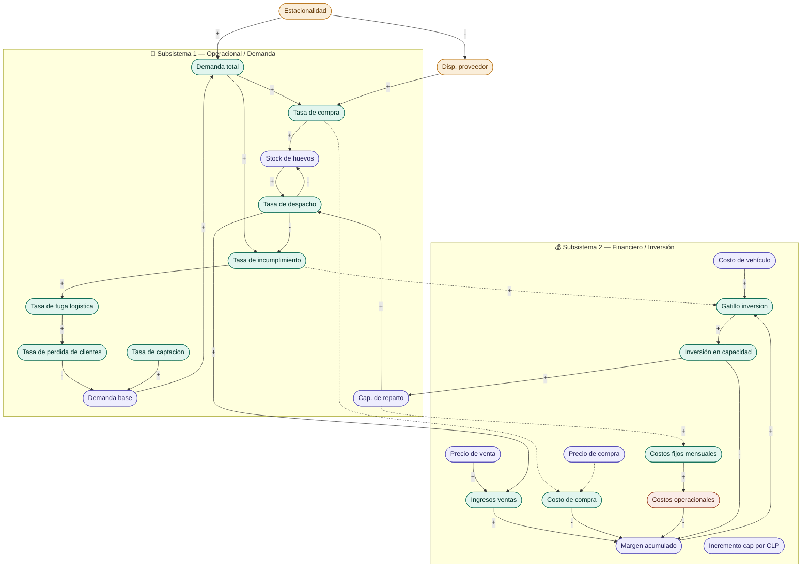
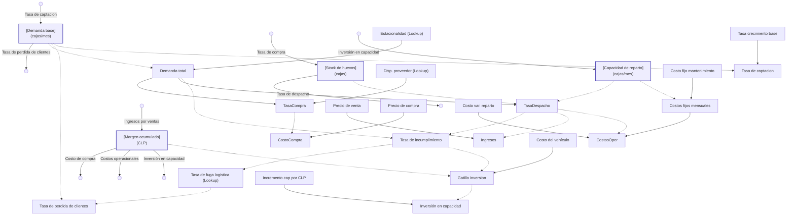

# Propuesta de Modelo Vensim: Distribuidora de Huevos (Timing de Capacidad de Reparto)

Este documento detalla la estructura conceptual, el diseño de Forrester, las ecuaciones propuestas y las **brechas de información** para construir y simular el modelo de la distribuidora de huevos bajo la propuesta de **Timing de Inversión y Demanda Creciente**.

---

## 1. Definición del Problema y Alcance

### Contexto
Una distribuidora de huevos se enfrenta a una demanda creciente de forma orgánica, agravada por la estacionalidad estival. Con una capacidad de reparto fija (867 cajas/mes), el negocio colapsa al inicio de la temporada alta. Esto provoca pedidos retrasados y una consecuente pérdida (fuga) de clientes estables, afectando la demanda futura. El negocio debe decidir el momento oportuno (timing) para adquirir un vehículo adicional (CLP 5.000.000 y nuevos costos fijos mensuales).

### Objetivos del Modelo
*   **Identificar el colapso (Cuello de botella):** Detectar en qué mes exacto la demanda supera la capacidad física, gatillando pedidos perdidos.
*   **Optimizar el Timing (Proactivo vs. Reactivo):** 
    *   *Reactivo:* Invertir solo cuando ya hay quiebres logísticos (tasa de incumplimiento > 10%) y se ha acumulado la caja.
    *   *Proactivo:* Invertir en el mes 6 antes del verano, utilizando crédito si es necesario, para evitar por completo la fuga de clientes.
*   **Probar la Resiliencia:** Simular el límite físico del crecimiento, demostrando cómo la insatisfacción frena la demanda futura si no hay infraestructura.

---

## 2. Diagrama Causal (CLD)

El modelo vincula el flujo físico de mercadería, la fuga de clientes y la inversión en transporte.

---

## 3. Diagrama de Forrester Propuesto

Las nubes (Fuentes y Sumideros) marcan los límites físicos y de caja de la distribuidora.

---

## 3.1. Guía de Dibujo en Vensim: Herramientas y Unidades

Para construir el diagrama de Forrester en Vensim de manera correcta, debes utilizar las siguientes herramientas de la barra superior de Vensim y asignar estas unidades:

| Variable en el Diagrama | Herramienta Vensim a Usar | Tipo en Vensim (*Type*) | Unidad de Medida | Descripción / Rol en el Modelo |
| :--- | :---: | :---: | :---: | :--- |
| **Demanda base** | `Box Variable (Nivel)` | **Level** | `cajas/mes` | Nivel que acumula el volumen estable de clientes. |
| **Stock de huevos** | `Box Variable (Nivel)` | **Level** | `cajas` | Stock físico de inventario acumulado en bodega. |
| **Margen acumulado** | `Box Variable (Nivel)` | **Level** | `CLP` | Las utilidades líquidas retenidas acumuladas en caja. |
| **Capacidad de reparto** | `Box Variable (Nivel)` | **Level** | `cajas/mes` | Límite logístico mensual de despacho de la flota. |
| **Tasa de captacion** | `Rate (Flujo)` | **Flow** | `cajas/mes/mes` | Crecimiento orgánico mensual de nuevos clientes. |
| **Tasa de perdida de clientes**| `Rate (Flujo)` | **Flow** | `cajas/mes/mes` | Pérdida de clientes mensuales debido al colapso. |
| **Tasa de compra** | `Rate (Flujo)` | **Flow** | `cajas/mes` | Abastecimiento mensual desde el proveedor. |
| **Tasa de despacho** | `Rate (Flujo)` | **Flow** | `cajas/mes` | Ventas físicas despachadas a clientes. |
| **Ingresos por ventas** | `Rate (Flujo)` | **Flow** | `CLP/mes` | Entrada financiera mensual por ventas de huevos. |
| **Costo de compra** | `Rate (Flujo)` | **Flow** | `CLP/mes` | Salida financiera mensual por pago al proveedor. |
| **Costos operacionales** | `Rate (Flujo)` | **Flow** | `CLP/mes` | Salida financiera mensual por costos fijos y variables. |
| **Inversión en capacidad** | `Rate (Flujo)` | **Flow** | `CLP/mes` | Desembolso de capital del margen para comprar flota. |
| **Demanda total** | `Auxiliary (Variable auxiliar)` | **Auxiliary** | `cajas/mes` | Demanda total estacional en el mes actual. |
| **Tasa de incumplimiento** | `Auxiliary (Variable auxiliar)` | **Auxiliary** | `Dmnl` (fracción) | Porcentaje de pedidos no entregados por colapso. |
| **Tasa de fuga logistica** | `Auxiliary (Variable auxiliar)` | **Lookup** | `Dmnl` (fracción) | Lookup que calcula el porcentaje de fuga de clientes. |
| **Tasa crecimiento base** | `Auxiliary (Variable auxiliar)` | **Constant** | `1/mes` | Tasa de crecimiento orgánico (fijada en 0.02). |
| **Estacionalidad** | `Auxiliary (Variable auxiliar)` | **Lookup** | `Dmnl` (adimensional) | Multiplicador mensual de demanda. |
| **Disponibilidad proveedor** | `Auxiliary (Variable auxiliar)` | **Lookup** | `Dmnl` (adimensional) | Factor de abastecimiento del proveedor (0.8 en verano). |
| **Precio de venta** | `Auxiliary (Variable auxiliar)` | **Constant** | `CLP/caja` | Valor unitario cobrado al cliente (11.500 CLP). |
| **Precio de compra** | `Auxiliary (Variable auxiliar)` | **Constant** | `CLP/caja` | Costo unitario cobrado por el proveedor (9.000 CLP). |
| **Costos fijos mensuales** | `Auxiliary (Variable auxiliar)` | **Auxiliary** | `CLP/mes` | Gastos de operación fijos (escala con la capacidad). |
| **Costo variable reparto** | `Auxiliary (Variable auxiliar)` | **Constant** | `CLP/caja` | Costo de reparto por caja (combustible, peajes). |
| **Costo de vehículo** | `Auxiliary (Variable auxiliar)` | **Constant** | `CLP` | Precio de compra de un vehículo nuevo (CLP 5.000.000). |
| **Costo fijo mantenimiento** | `Auxiliary (Variable auxiliar)` | **Constant** | `CLP/caja/mes` | Costo de chofer/mantenimiento por capacidad nueva. |
| **Gatillo inversion** | `Auxiliary (Variable auxiliar)` | **Auxiliary** | `Dmnl` (booleano) | Variable lógica que habilita o no la compra de flota. |
| **Politica proactiva** | `Auxiliary (Variable auxiliar)` | **Constant** | `Dmnl` (booleano) | Bandera (0 = Reactiva, 1 = Proactiva). |
| **Incremento cap por CLP** | `Auxiliary (Variable auxiliar)` | **Constant** | `(cajas/mes)/CLP` | Factor para traducir inversión en CLP a capacidad física. |
| **Time** | `Shadow Variable` (Var. Sombra) | **Shadow** | `mes` | Variable temporal interna para evaluar los Lookups. |
| **TIME STEP** | `Shadow Variable` (Var. Sombra) | **Shadow** | `mes` | Paso de integración de la simulación (fijado en 1). |

---

## 4. Ecuaciones Propuestas para Vensim

### 4.1. Configuración de Simulación
*   **INITIAL TIME** = 1
*   **FINAL TIME** = 12
*   **TIME STEP** = 1
*   **Units for Time** = Mes (meses)

### 4.2. Subsistema 1: Operacional y Demanda (Unidades: cajas, meses)
1.  **Demanda base** = `INTEG(Tasa_de_captacion - Tasa_de_perdida_de_clientes, 700)`
    *   *Unidad:* cajas/mes.
2.  **Tasa de captacion** = `Demanda_base * Tasa_crecimiento_base`
    *   *Unidad:* cajas/mes/mes.
3.  **Tasa crecimiento base** = `0.02`
    *   *Unidad:* 1/mes. (Representa un 2% mensual de crecimiento de clientes estables).
4.  **Tasa de perdida de clientes** = `Demanda_base * Tasa_de_fuga_logistica`
    *   *Unidad:* cajas/mes/mes.
5.  **Tasa de fuga logistica** = `WITH LOOKUP (Tasa_de_incumplimiento)`
    *   *Puntos (x, y):* `((0, 0), (0.1, 0.02), (0.3, 0.10), (0.5, 0.25))`
    *   *Lógica:* Si el incumplimiento de despachos es 0%, no hay fuga. Si llega a 30%, perdemos el 10% de la demanda base en ese periodo.
6.  **Tasa de incumplimiento** = `MAX(0, (Demanda_total - Tasa_de_despacho) / Demanda_total)`
    *   *Unidad:* Dmnl.
7.  **Stock de huevos** = `INTEG(Tasa_de_compra - Tasa_de_despacho, 200)`
    *   *Unidad:* cajas.
8.  **Tasa de compra** = `Demanda_total * Disponibilidad_proveedor`
    *   *Unidad:* cajas/mes.
9.  **Tasa de despacho** = `MIN(Capacidad_de_reparto, Demanda_total, Stock_de_huevos / TIME STEP)`
    *   *Unidad:* cajas/mes.
10. **Capacidad de reparto** = `INTEG(Inversión_en_capacidad * Incremento_cap_por_CLP, 867)`
    *   *Unidad:* cajas/mes. (Inicia en 867 cajas/mes).
11. **Demanda total** = `Demanda_base * Estacionalidad`
    *   *Unidad:* cajas/mes.
12. **Estacionalidad** = `WITH LOOKUP (Time)`
    *   *Puntos (x, y):* `((1, 1.84), (2, 1.81), (3, 0.84), (4, 0.78), (5, 0.90), (6, 0.75), (7, 0.84), (8, 0.67), (9, 0.69), (10, 0.91), (11, 0.71), (12, 1.27))`
13. **Disponibilidad proveedor** = `WITH LOOKUP (Time)`
    *   *Puntos (x, y):* `((1, 0.8), (2, 0.8), (3, 1.0), (12, 1.0))`

### 4.3. Subsistema 2: Financiero y de Inversión (Unidades: CLP, meses)
14. **Margen acumulado** = `INTEG(Ingresos_por_ventas - Costo_de_compra - Costos_operacionales - Inversión_en_capacidad, 0)`
    *   *Unidad:* CLP.
15. **Inversión en capacidad** = `IF THEN ELSE(Gatillo_inversion > 0, Costo_de_vehículo / TIME STEP, 0)`
    *   *Unidad:* CLP/mes.
16. **Gatillo inversion** = `IF THEN ELSE(Politica_proactiva > 0, STEP(1, 6), IF THEN ELSE(Margen_acumulado > Costo_de_vehículo AND Tasa_de_incumplimiento > 0.1, 1, 0))`
    *   *Unidad:* Dmnl.
    *   *Lógica:* Si la política es proactiva, invierte en el mes 6. Si es reactiva, espera tener la caja suficiente Y que la tasa de pedidos incumplidos sea mayor al 10%.
17. **Politica proactiva** = `0` (para Escenario Base y Reactivo) o `1` (para Escenario Proactivo).
    *   *Unidad:* Dmnl.
18. **Ingresos por ventas** = `Tasa_de_despacho * Precio_de_venta`
    *   *Unidad:* CLP/mes.
19. **Costo de compra** = `Tasa_de_compra * Precio_de_compra`
    *   *Unidad:* CLP/mes.
20. **Costos operacionales** = `Costos_fijos_mensuales + (Tasa_de_despacho * Costo_variable_reparto)`
    *   *Unidad:* CLP/mes.
21. **Costos fijos mensuales** = `200000 + (Capacidad_de_reparto - 867) * Costo_fijo_mantenimiento`
    *   *Unidad:* CLP/mes.
    *   *Lógica:* Al comprar capacidad adicional, se incrementan los costos fijos por sueldos de chofer y mantenimiento del nuevo camión.
22. **Costo fijo mantenimiento** = `200`
    *   *Unidad:* CLP/caja/mes. (Representa que añadir 500 unidades de capacidad suma $100.000 al mes de costo fijo).
23. **Precio de venta** = `11500` (Unidad: CLP/caja)
24. **Precio de compra** = `9000` (Unidad: CLP/caja)
25. **Costo de vehículo** = `5000000` (Unidad: CLP)
26. **Incremento cap por CLP** = `0.0001` (Unidad: (cajas/mes)/CLP. Traduce los 5 millones a 500 unidades de capacidad).
27. **Costo variable reparto** = `500` (Unidad: CLP/caja)

---

## 5. 🔍 Brechas de Información a Investigar (Tareas del Usuario)

Para calibrar perfectamente el modelo para tu entrega final, debes investigar los siguientes valores del negocio real:
1.  **Tasa de fuga real de clientes:** ¿Qué porcentaje de tus clientes se van del negocio tras experimentar retrasos o quiebres de entrega en verano?
2.  **Crecimiento orgánico mensual:** ¿Cuál es el crecimiento promedio mensual real de la distribuidora fuera del verano para calibrar el 2% propuesto?
3.  **Aumento del Costo Fijo:** ¿Cuál es la remuneración promedio de un chofer de reparto adicional en tu zona para ajustar la constante `Costo_fijo_mantenimiento`?
