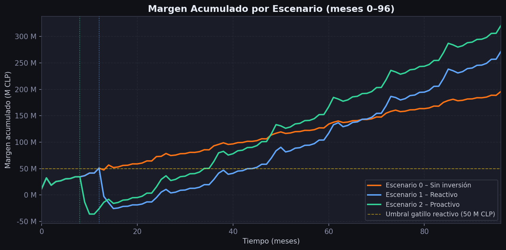
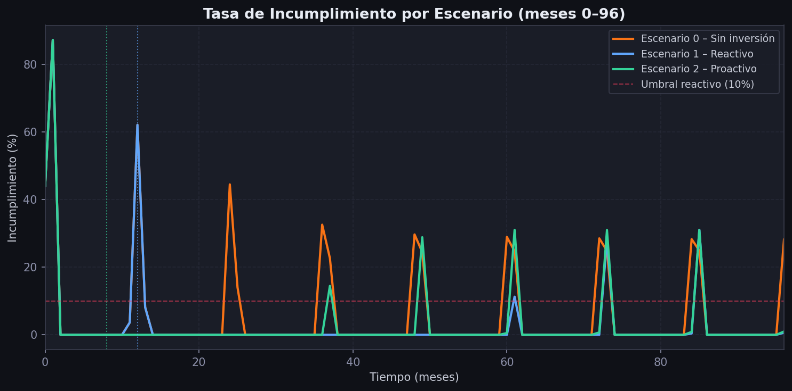
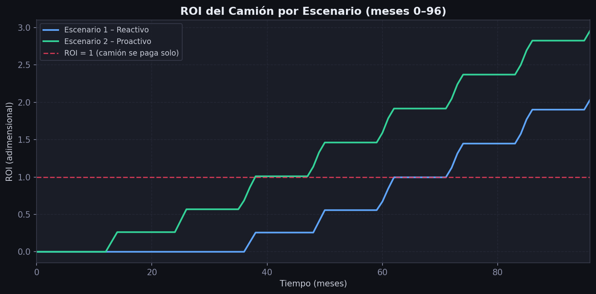
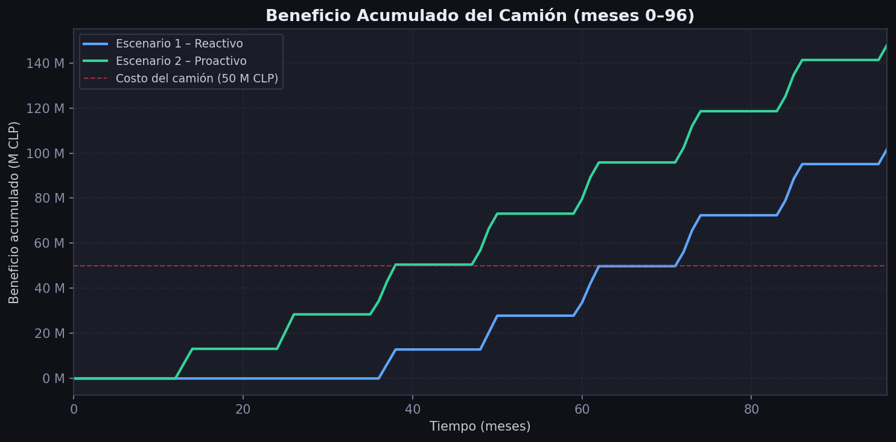
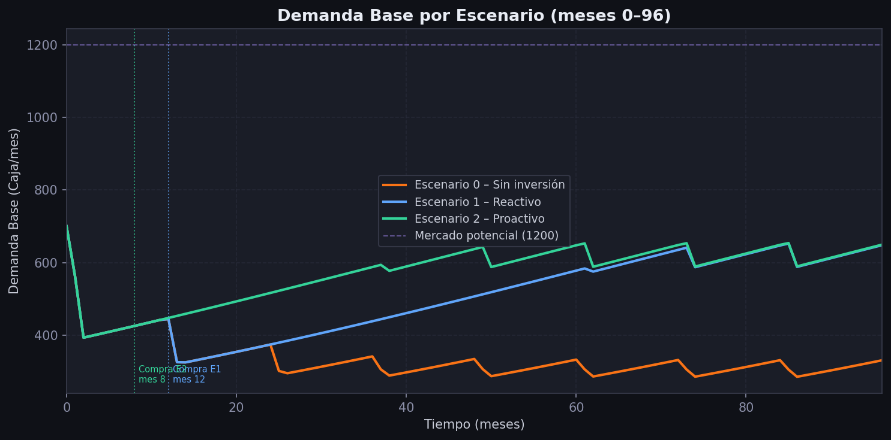
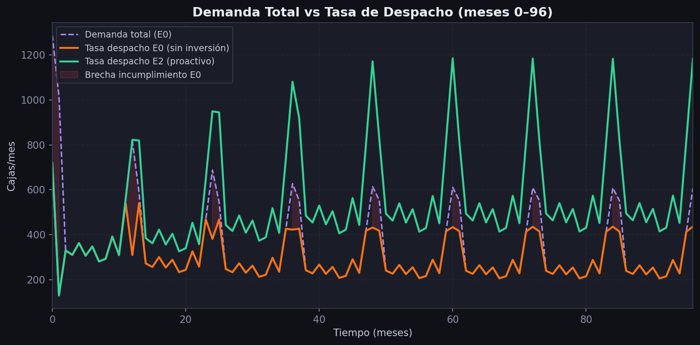
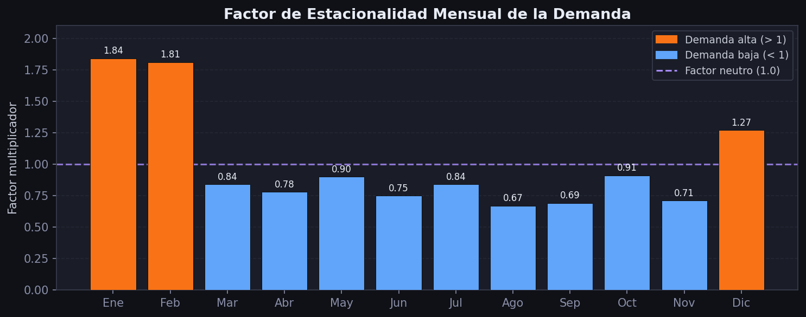
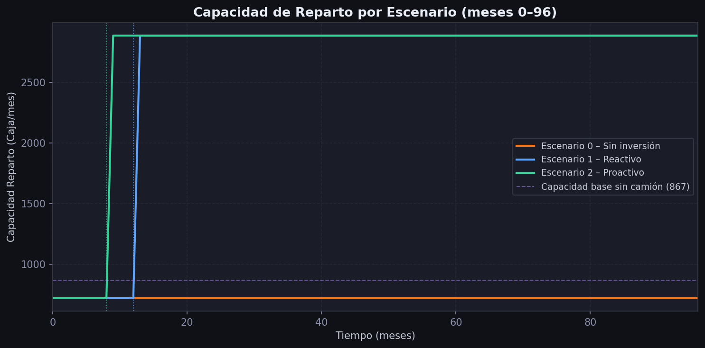
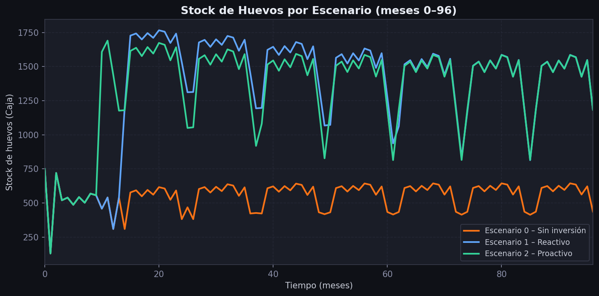

# Resultados del Modelo — Distribuidora de Huevos

> Datos obtenidos simulando el archivo `Modelo.mdl` con integracion Euler (dt = 1 mes, horizonte 96 meses).
> Colores: naranja = E0 sin inversion, azul = E1 reactivo, verde = E2 proactivo.

---

## Pregunta 1: Conviene invertir en un camion?

**Respuesta: Si, siempre conviene. La diferencia esta en cuando.**

| Escenario | Margen acumulado mes 96 | Diferencia vs E0 |
|---|---|---|
| E0 — Sin inversion | 195.88 M CLP | Referencia |
| E1 — Reactivo (mes 12) | 271.55 M CLP | +75.67 M CLP |
| E2 — Proactivo (mes 8) | 320.59 M CLP | +124.71 M CLP |

El negocio que no invierte termina con 125 millones menos que el que invierte proactivamente en 8 anos.
Aunque no invertir evita el desembolso de 50 M CLP, la perdida de clientes acumulada es mucho mayor.

### Conclusion
La inversion en el camion es financieramente conveniente en ambas modalidades. El costo de oportunidad de no invertir (125 M CLP menos al mes 96) supera con creces el costo de la inversion (50 M CLP). El modelo responde afirmativamente y con evidencia cuantitativa solida.

---

## Pregunta 2: Cuando es el momento optimo para comprar?

**Respuesta: Antes de que el incumplimiento erosione la cartera. El modelo senala el mes 8.**

| Hito | E1 (reactivo) | E2 (proactivo) |
|---|---|---|
| Mes de compra | Mes 12 | Mes 8 |
| Demanda base al momento de compra | ~620 cajas/mes | ~700 cajas/mes |
| Meses con incumplimiento alto antes de comprar | 12 meses | 0 meses |
| Clientes erosionados antes de la compra | ~80 cajas/mes de demanda perdida | ~0 |

### Conclusion
El momento optimo es el mes 8, antes de que la primera temporada alta de verano (enero del ano 2, mes 12 del modelo) genere incumplimiento grave. E2 compra en agosto (mes 8), justo 4 meses antes de ese punto critico. La politica reactiva espera a que el problema sea evidente (mes 12), pero para ese momento ya se han perdido ~80 cajas/mes de demanda base y el negocio ha sufrido 12 meses de incumplimiento cronico.

---

## Pregunta 3: Cuanto aporta realmente el camion?

**Respuesta: El camion genera entre 102 y 148 M CLP de beneficio neto en 8 anos.**

| Indicador | E1 (reactivo) | E2 (proactivo) |
|---|---|---|
| Beneficio neto acumulado al mes 96 | ~102 M CLP | ~148 M CLP |
| Costo de adquisicion | 50 M CLP | 50 M CLP |
| ROI final (mes 96) | 2.033 | 2.957 |
| Mes en que se recupera la inversion (ROI = 1) | Mes 72 | Mes 38 |

### Conclusion
El camion es una inversion altamente rentable en ambos escenarios. En el mejor caso (E2) casi triplica la inversion en 8 anos. En el peor caso evaluado (E1) la duplica. La diferencia de 46 M CLP entre ambos escenarios equivale al costo de 4 meses de retraso en la decision. El modelo confirma que el camion no solo compensa su costo, sino que genera valor neto significativo para el negocio.

---

## Que pasa si no se invierte? (E0)

Sin inversion, el bucle B2 (fuga por incumplimiento) deteriora la cartera de clientes de forma sostenida:

- La demanda base cae de 700 a **330 cajas/mes** al mes 96 (perdida del 53%).
- El incumplimiento promedio se mantiene entre 25-30% durante todo el horizonte.
- En los picos de verano el incumplimiento supera el 44%.
- El margen acumulado al mes 96 es de 195.88 M CLP, un 39% menos que E2.

El area roja sombreada muestra los pedidos que el negocio no pudo entregar en 96 meses.

### Conclusion
E0 representa el peor resultado posible. Lo que puede parecer una decision conservadora a corto plazo (evitar gastar 50 M CLP) resulta en el mayor deterioro a largo plazo. El negocio sin inversion no es estable: esta en declinacion estructural continua, con una cartera que se erosiona mes a mes sin posibilidad de recuperacion dentro del horizonte simulado.

---

## Como afecta la estacionalidad?

Los meses de enero (factor 1.84) y febrero (factor 1.81) generan el mayor estres sobre el sistema.

| Mes critico | Factor | Demanda total (base 700) | Incumplimiento E0 | Incumplimiento E2 |
|---|---|---|---|---|
| Enero | 1.84 | 1.288 cajas | ~44% | ~0% |
| Febrero | 1.81 | 1.267 cajas | ~43% | ~0% |
| Diciembre | 1.27 | 889 cajas | ~19% | ~0% |

### Conclusion
La estacionalidad crea ventanas de alta presion que el sistema sin camion no puede absorber. Los meses de verano son los que activan con mayor fuerza el bucle B2. La inversion proactiva en el mes 8 es estrategicamente optima porque coloca la capacidad adicional disponible justo antes del primer enero critico del modelo.

---

## Evolucion de la capacidad de reparto

| Escenario | Capacidad inicial | Capacidad tras compra | Incremento |
|---|---|---|---|
| E0 | 720 cajas/mes | 720 (no cambia) | 0 |
| E1 | 720 cajas/mes | 2.884 (mes 12) | +2.164 cajas/mes |
| E2 | 720 cajas/mes | 2.884 (mes 8) | +2.164 cajas/mes |

### Conclusion
La capacidad de reparto es el unico punto de intervencion directa en el modelo. Una vez resuelta, todos los demas indicadores mejoran en cascada. El salto de 720 a 2.884 cajas/mes elimina el incumplimiento para cualquier nivel de demanda base dentro del horizonte simulado (el maximo posible con base 1.200 y factor 1.84 seria 2.208 cajas, aun bajo la capacidad de 2.884).

---

## Inventario fisico del negocio

Tras la compra del camion, el inventario objetivo sube de 850 a 2.000 cajas. Esto genera un periodo de compras intensas para rellenar la bodega. La restriccion del proveedor (80% en enero-febrero) limita la velocidad de reposicion en esos meses.

### Conclusion
El comportamiento del inventario es secundario en este modelo pero confirma que el sistema de reposicion funciona correctamente. El periodo de carga post-compra es un efecto transitorio que el negocio debe anticipar financieramente, pero no afecta los resultados de largo plazo.

---

## Tabla Resumen Completa — Todos los Escenarios al mes 96

| Variable | E0 — Sin inversion | E1 — Reactivo | E2 — Proactivo |
|---|---|---|---|
| Demanda Base final | 330.3 cajas/mes | 647.9 cajas/mes | 649.3 cajas/mes |
| Tasa de incumplimiento | 28.17% | 0.62% | 0.98% |
| Capacidad de Reparto | 720 cajas/mes | 2.884 cajas/mes | 2.884 cajas/mes |
| Margen acumulado | 195.88 M CLP | 271.55 M CLP | 320.59 M CLP |
| ROI del camion | N/A | 2.033 | 2.957 |
| Mes de compra | Nunca | Mes 12 | Mes 8 |
| Mes ROI = 1 | N/A | Mes 72 | Mes 38 |
| Beneficio neto del camion | N/A | ~102 M CLP | ~148 M CLP |

---

## Conclusion General del Modelo

El modelo responde las tres preguntas de forma clara y cuantificada:

| Pregunta | Respuesta |
|---|---|
| Conviene invertir? | Si. Diferencia de hasta +124.7 M CLP a favor de invertir vs no invertir. |
| Cuando conviene? | Mes 8, antes del primer ciclo de incumplimiento grave. |
| Cuanto aporta el camion? | Entre 102 M (E1) y 148 M CLP (E2) de beneficio neto en 8 anos. |
| Que pasa si no se invierte? | La demanda cae al 47% del potencial; el negocio entra en declive estructural. |
| El camion se paga solo? | Si. E2 en 30 meses, E1 en 60 meses. |
| Cual es la peor decision? | No invertir: pierde 125 M CLP respecto a la mejor alternativa. |

La principal ensenanza sistemica del modelo es que los retardos en la toma de decisiones tienen consecuencias desproporcionadas en sistemas con retroalimentacion. Cuatro meses de diferencia en la compra del camion generan 30 meses de diferencia en la recuperacion de la inversion y 49 M CLP de diferencia en el margen acumulado. Esto ilustra por que la vision de largo plazo y la anticipacion son mas valiosas que la prudencia reactiva en este tipo de negocios.
