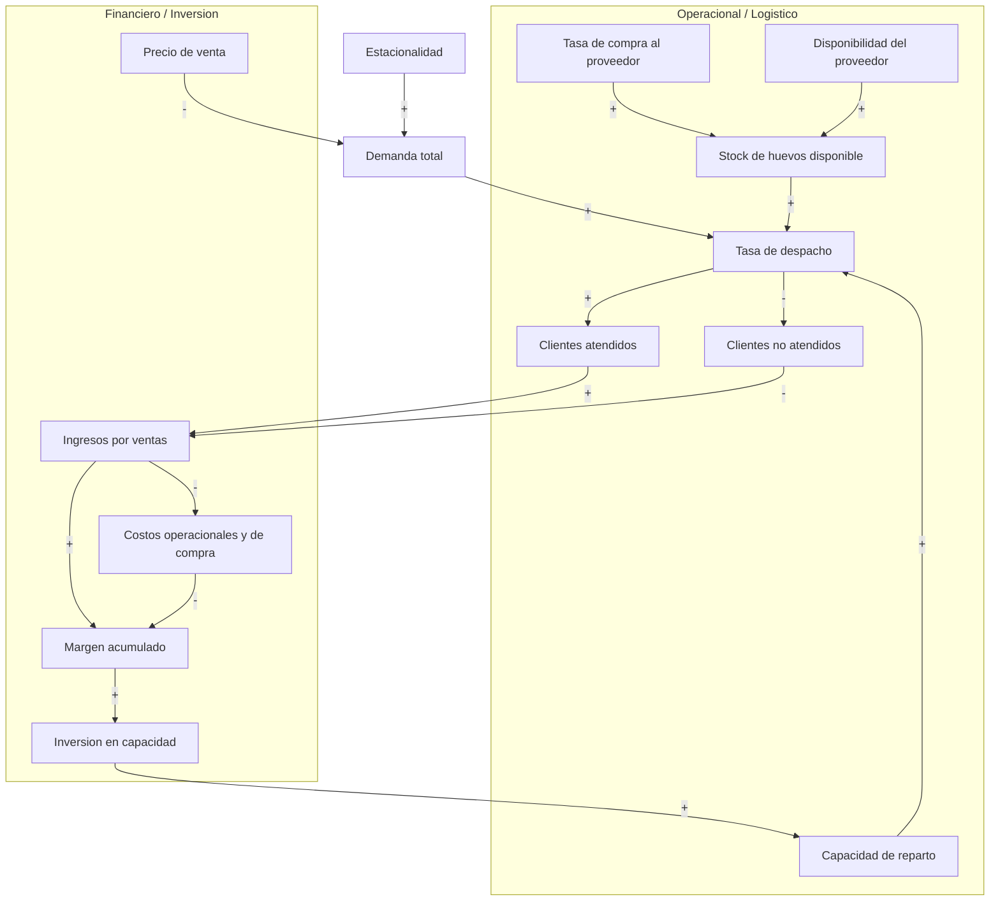

# Qué hacer

El proyecto final del curso consiste en analizar un problema real mediante herramientas de dinámica de sistemas. Cada grupo deberá seleccionar una situación concreta, describirla como un sistema, identificar sus variables principales.

Propuesta concreta — Distribuidora de Huevos:

- Definir el problema y alcance: saturación de capacidad en temporada alta y pérdidas de oportunidad de ventas.
- Identificar subsistemas: Operacional / Logístico y Financiero / Inversión.
- Variables principales a incluir: Stock de huevos disponible, Tasa de compra al proveedor, Disponibilidad del proveedor, Tasa de despacho, Capacidad de reparto, Demanda total, Estacionalidad, Ingresos por ventas, Precio de venta, Costo de compra, Costos operacionales, Margen acumulado, Capacidad de inversión, Inversión en capacidad.
- Identificar bucles de retroalimentación (ej.: crecimiento por inversión, cuello de botella operacional, tensión precio-volumen).
- Construir diagrama causal y diagrama de Forrester.
- Implementar el modelo (recomendado: Python con `numpy` y `matplotlib`, o Vensim) y fijar valores iniciales y supuestos.
- Simular dos escenarios mínimos: escenario base (sin inversión) y escenario de mejora (compra de vehículo y personal), analizar recuperación de inversión y sensibilidad.

Próximos pasos sencillos:

1. Recolectar datos históricos y supuestos razonados.
2. Definir valores iniciales y parámetros estacionales.
3. Dibujar diagrama causal y validar bucles.
4. Implementar y simular los escenarios.

Estos pasos cumplen los requisitos del curso y permiten responder a la pregunta central: ¿cuándo conviene invertir en más capacidad y cómo afecta la rentabilidad en el tiempo?

## Representar sus relaciones causales

Podemos graficar las relaciones causales directamente en este archivo usando Mermaid, que GitHub renderiza en Markdown.

Si quieres, adapto el diagrama (nodos, etiquetas o diseño) o creo una versión en bucle causal más formal (CLD) con notación de polaridad explícita.

## Construir el modelo y cómo simularlo (usar datos del README de Carlos)

Usa las variables y el contexto que ya aparecen en [la propuesta de Carlos](../readme.md). La plantilla del modelo debe emplear los nombres de variables que se indican abajo para facilitar la integración con el informe y futuros datos de producto.

- **Propósito:** responder la pregunta del proyecto: ¿cuándo conviene invertir en más capacidad (vehículo, personal) y cómo impacta en la rentabilidad?
- **Contexto conocido (usar en el modelo):** 2 supermercados, restaurantes locales, almacenes y un nuevo punto minorista; uso de camión familiar como soporte en verano; estacionalidad marcada en verano.

- **Variables:**
	- `Stock_de_huevos` — Stock en bodega (cajas)
	- `Tasa_compra_proveedor` — cajas/periodo
	- `Disponibilidad_proveedor` — factor (0-1) por periodo
	- `Tasa_despacho` — cajas/periodo
	- `Capacidad_reparto` — capacidad efectiva (cajas/periodo)
	- `Demanda_total` — demanda agregada por periodo
	- `Estacionalidad` — factor temporal (picos en verano)
	- `Ingresos_ventas` — moneda/periodo (calculado)
	- `Precio_venta` — moneda/caja
	- `Costo_compra` — moneda/caja (proveedor)
	- `Costos_operacionales` — moneda/periodo (combustible, personal, arriendo)
	- `Margen_acumulado` — moneda acumulada
	- `Capacidad_inversion` — umbral o fondo disponible para invertir
	- `Inversion_capacidad` — gasto en capacidad (moneda)

- **Stocks y flujos (nombres recomendados):**
	- Stocks: `Stock_de_huevos`, `Margen_acumulado`, `Capacidad_reparto`.
	- Flujos: `Compra_rate` (`Tasa_compra_proveedor`), `Despacho_rate` (`Tasa_despacho`), `Inversion_rate` (`Inversion_capacidad`).

- **Ecuaciones base (discretas, dt=1 periodo):**
	- `Stock_de_huevos[t+1] = Stock_de_huevos[t] + Compra_rate[t] - Despacho_rate[t]`
	- `Margen_acumulado[t+1] = Margen_acumulado[t] + Ingresos_ventas[t] - Costos_operacionales[t] - Costo_compra * Compra_rate[t]`
	- `Capacidad_reparto[t+1] = Capacidad_reparto[t] + Inversion_rate[t]`

- **Funciones auxiliares (implementarlas con estos nombres):**
	- `Demanda_estacional(t) = Demanda_total_base * Estacionalidad[t]`
	- `Cumplimiento = min(Disponibilidad_proveedor * Compra_rate_capacity_factor, Capacidad_reparto, Demanda_total)`
	- `Despacho_rate = min(Stock_de_huevos, Cumplimiento)`
	- `Ingresos_ventas = Despacho_rate * Precio_venta`

- **Datos concretos a preparar (usa estos archivos/columnas):**
	- `data/historico.csv` — columnas: `periodo`, `canal` (supermercado/restaurante/almacen/punto), `volumen` (cajas)
	- `data/disp_proveedor.csv` — `periodo`, `disponibilidad` (0-1)
	- `data/costos.csv` — `periodo`, `combustible`, `personal`, `arriendo`, `otros`
	- `params.yaml` — `Precio_venta`, `Costo_compra`, `costo_vehiculo`, `capacidad_vehiculo`, `costo_personal`

- **Validación con los datos de Carlos:**
	- Calibrar `Tasa_compra_proveedor` y `Precio_venta` para que el modelo reproduzca los volúmenes históricos agregados por `data/historico.csv`.
	- Verificar que el modelo captura picos estacionales (veranos) y que las métricas de pedidos no atendidos coinciden con los registros.

- **Escenarios (nombres/entradas):**
	- `base`: operación actual (incluye `camion_familiar` capacidad/ cost en `params.yaml`).
	- `mejora`: `costo_vehiculo`, `capacidad_vehiculo`, `costo_personal` definidos en `params.yaml`.

- **Salidas y métricas:**
	- `payback_period` (periodos para recuperar `costo_vehiculo`), `porcentaje_pedidos_no_atendidos`, `ingresos_acumulados`, `margen_acumulado` por escenario.

- **Estructura mínima de implementación:**
	- `model/params.yaml` (nombres exactos listados arriba)
	- `model/model.py` (simulador discreto)
	- `run_scenarios.py` (correr `base` y `mejora` y guardar salidas en `outputs/`)
	- `data/historico.csv`, `data/costos.csv`, `data/disp_proveedor.csv`

Cuando me des los datos de producto y volúmenes, los incorporaré en `data/historico.csv` y genero la plantilla Python (`model.py`, `params.yaml`, `run_scenarios.py`) con valores iniciales de ejemplo. ¿Lo genero ahora con valores ficticios o prefieres que espere tus datos reales?

