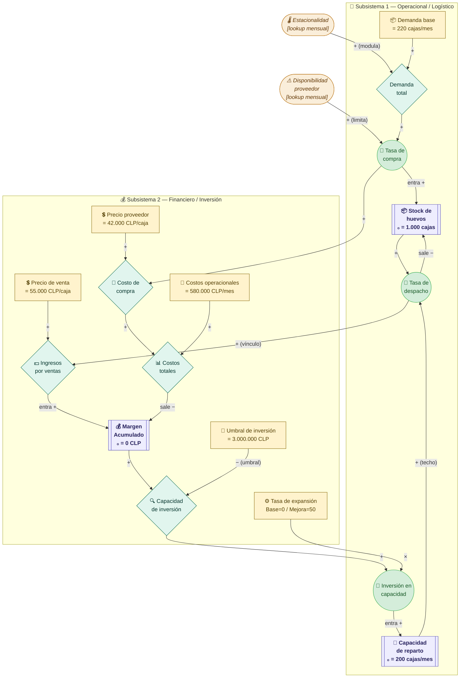
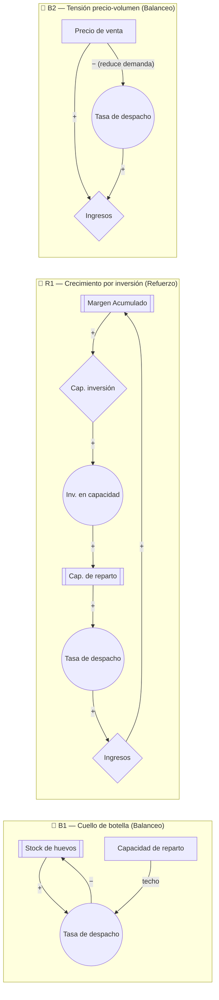

# 🥚 Modelo Dinámica de Sistemas — Distribuidora de Huevos
## Diagrama de Forrester + Parámetros del Modelo

---

## 1. Diagrama de Forrester (Vensim-style en Mermaid)

> **Convención visual:**
> - 🟦 `[[ ]]` → **Stock / Nivel** (rectángulo doble)
> - `(( ))` → **Flujo** (válvula/flecha gruesa)
> - `{ }` → **Variable auxiliar**
> - `[ ]` → **Parámetro / Constante**
> - `(( ))` con borde naranja → **Variable exógena**



---

## 2. Bucles de retroalimentación



---

## 3. Variables del modelo — Tabla completa

### 3.1 Stocks (Niveles)

| Variable | Símbolo | Valor inicial | Unidad | Ecuación INTEG | Descripción |
|----------|---------|:-------------:|--------|----------------|-------------|
| Stock de huevos | `SH` | 1.000 | cajas | `INTEG(Tasa_compra − Tasa_despacho, 1000)` | Inventario físico en bodega |
| Margen Acumulado | `MA` | 0 | CLP | `INTEG(Ingresos − Costos_totales, 0)` | Rentabilidad acumulada del negocio |
| Capacidad de reparto | `CR` | 200 | cajas/mes | `INTEG(Inversion_en_capacidad, 200)` | Variable principal — techo operacional del sistema |

### 3.2 Flujos

| Variable | Símbolo | Unidad | Ecuación | Descripción |
|----------|---------|--------|----------|-------------|
| Tasa de compra | `TC` | cajas/mes | `MIN(Demanda_total, Disp_proveedor × Demanda_total)` | Compra limitada por disponibilidad del proveedor |
| Tasa de despacho | `TD` | cajas/mes | `MIN(Stock_huevos, Capacidad_reparto)` | Despacho limitado por stock Y capacidad de reparto |
| Ingresos | `IV` | CLP/mes | `Tasa_despacho × Precio_venta` | Ingresos brutos por ventas del período |
| Costos totales | `CT` | CLP/mes | `Costo_compra + Costos_operacionales` | Egresos totales del período |
| Inversión en capacidad | `TINV` | cajas/mes² | `Capacidad_inversion × Tasa_expansion` | Flujo de expansión de capacidad cuando se activa |

### 3.3 Variables auxiliares

| Variable | Símbolo | Unidad | Ecuación | Descripción |
|----------|---------|--------|----------|-------------|
| Demanda total | `DT` | cajas/mes | `Demanda_base × Estacionalidad` | Demanda real modulada por época del año |
| Costo de compra | `CC` | CLP/mes | `Tasa_compra × Precio_proveedor` | Gasto mensual en adquisición |
| Capacidad de inversión | `CI` | adim. | `IF(MA > Umbral_inversion, 1, 0)` | Indicador binario: ¿hay margen para invertir? |

### 3.4 Parámetros y constantes

| Parámetro | Símbolo | Valor base | Valor mejora | Unidad | Fuente / Justificación |
|-----------|---------|:----------:|:------------:|--------|------------------------|
| Demanda base | `DBASE` | 220 | 220 | cajas/mes | Calibrado desde ventas 2025 fuera de temporada |
| Precio de venta | `PV` | 55.000 | 60.000 (+verano) | CLP/caja | Estimado: ventas totales 2025 / volumen anual |
| Precio proveedor | `PP` | 42.000 | 42.000 | CLP/caja | Estimado: compras totales 2025 / volumen anual |
| Costos operacionales | `CO` | 580.000 | 780.000 (+personal) | CLP/mes | Estimado basado en márgenes 2025 |
| Umbral de inversión | `UI` | 3.000.000 | 3.000.000 | CLP | ≈ costo vehículo de reparto usado |
| Tasa de expansión | `TEXP` | **0** | **50** | cajas/mes² | 0 = sin inversión; 50 = compra vehículo + personal |

### 3.5 Variables exógenas (lookup mensual)

#### Estacionalidad — índice mensual calibrado con ventas 2025

| Mes | Índice | Justificación |
|-----|:------:|---------------|
| Enero | 1,80 | Peak verano — ventas más altas del año |
| Febrero | 1,70 | Continúa temporada alta |
| Marzo | 0,80 | Caída marcada post-verano |
| Abril | 0,70 | Mes bajo |
| Mayo | 0,80 | Leve recuperación |
| Junio | 0,70 | Mes bajo |
| Julio | 0,75 | Mes bajo |
| Agosto | 0,60 | Mes más bajo del año |
| Septiembre | 0,65 | Mes bajo |
| Octubre | 0,85 | Inicio recuperación |
| Noviembre | 0,75 | Mes moderado |
| Diciembre | 1,20 | Pre-temporada alta |

#### Disponibilidad del proveedor — fracción satisfecha

| Mes | Fracción | Justificación |
|-----|:--------:|---------------|
| Enero | 0,80 | −20% en verano (experiencia 2 temporadas consecutivas) |
| Febrero | 0,80 | −20% en verano |
| Marzo–Noviembre | 1,00 | Disponibilidad normal |
| Diciembre | 0,90 | Inicio de restricción pre-verano |

---

## 4. Ecuaciones del modelo (para ingresar en Vensim manualmente)

```
Stock de huevos = INTEG( Tasa de compra - Tasa de despacho, 1000 )
    UNITS: cajas

Margen Acumulado = INTEG( Ingresos - Costos totales, 0 )
    UNITS: CLP

Capacidad de reparto = INTEG( Inversion en capacidad, 200 )
    UNITS: cajas/mes

──────────────────────────────────────────────────────────────

Tasa de compra = MIN( Demanda total, Disponibilidad proveedor * Demanda total )
    UNITS: cajas/mes

Tasa de despacho = MIN( Stock de huevos, Capacidad de reparto )
    UNITS: cajas/mes

Ingresos = Tasa de despacho * Precio de venta
    UNITS: CLP/mes

Costos totales = Costo de compra + Costos operacionales
    UNITS: CLP/mes

Costo de compra = Tasa de compra * Precio proveedor
    UNITS: CLP/mes

Inversion en capacidad = Capacidad de inversion * Tasa de expansion
    UNITS: cajas/mes/mes

──────────────────────────────────────────────────────────────

Demanda total = Demanda base * Estacionalidad
    UNITS: cajas/mes

Capacidad de inversion = IF THEN ELSE( Margen Acumulado > Umbral de inversion, 1, 0 )
    UNITS: Dmnl

──────────────────────────────────────────────────────────────

Demanda base = 220          UNITS: cajas/mes
Precio de venta = 55000     UNITS: CLP/caja
Precio proveedor = 42000    UNITS: CLP/caja
Costos operacionales = 580000   UNITS: CLP/mes
Umbral de inversion = 3000000   UNITS: CLP
Tasa de expansion = 0       UNITS: cajas/mes/mes   ← cambiar a 50 en escenario mejora

──────────────────────────────────────────────────────────────

Estacionalidad = WITH LOOKUP( Time,
    ([(0,0)-(25,3)],
    (0,1.8),(1,1.8),(2,1.7),(3,0.8),(4,0.7),(5,0.8),(6,0.7),
    (7,0.75),(8,0.6),(9,0.65),(10,0.85),(11,0.75),(12,1.2),
    (13,1.8),(14,1.7),(15,0.8),(16,0.7),(17,0.8),(18,0.7),
    (19,0.75),(20,0.6),(21,0.65),(22,0.85),(23,0.75),(24,1.2))
)
    UNITS: Dmnl

Disponibilidad proveedor = WITH LOOKUP( Time,
    ([(0,0)-(25,1.1)],
    (0,0.8),(1,0.8),(2,0.8),(3,1),(4,1),(5,1),(6,1),
    (7,1),(8,1),(9,1),(10,1),(11,1),(12,0.9),
    (13,0.8),(14,0.8),(15,1),(16,1),(17,1),(18,1),
    (19,1),(20,1),(21,1),(22,1),(23,1),(24,0.9))
)
    UNITS: Dmnl

──────────────────────────────────────────────────────────────

INITIAL TIME = 0        UNITS: mes
FINAL TIME = 24         UNITS: mes   (2 años: 2025-2026)
TIME STEP = 0.25        UNITS: mes
SAVEPER = TIME STEP
```

---

## 5. Escenarios de simulación

### Escenario Base — sin intervención

| Parámetro modificado | Valor |
|---------------------|-------|
| Tasa de expansión | **0** (sin inversión nueva) |
| Precio de venta | 55.000 CLP/caja (fijo) |
| Costos operacionales | 580.000 CLP/mes |

**Comportamiento esperado:** La capacidad de reparto se mantiene en 200 cajas/mes. En enero-febrero la demanda supera la capacidad → despacho limitado → margen subóptimo. El sistema no crece.

### Escenario de Mejora — inversión en vehículo y personal

| Parámetro modificado | Valor base → Valor nuevo |
|---------------------|--------------------------|
| Tasa de expansión | 0 → **50** cajas/mes² |
| Precio de venta (verano) | 55.000 → **60.000** CLP/caja |
| Costos operacionales | 580.000 → **780.000** CLP/mes (+personal) |

**Comportamiento esperado:** Cuando el margen supera 3.000.000 CLP, se activa la inversión → capacidad de reparto crece → más despacho en verano → mayor margen acumulado (bucle R1 dominante).

---

## 6. Cómo construir el diagrama en Vensim paso a paso

### Paso 1 — Crear los 3 stocks
1. Herramienta **Box** → dibuja `Stock de huevos`
2. Herramienta **Box** → dibuja `Margen Acumulado`
3. Herramienta **Box** → dibuja `Capacidad de reparto`

### Paso 2 — Agregar los flujos (válvulas)
Para cada flujo: herramienta **Arrow con válvula** entre nube y stock:
- Nube → `Tasa de compra` → `Stock de huevos`
- `Stock de huevos` → `Tasa de despacho` → Nube
- Nube → `Ingresos` → `Margen Acumulado`
- `Margen Acumulado` → `Costos totales` → Nube
- Nube → `Inversion en capacidad` → `Capacidad de reparto`

### Paso 3 — Agregar variables auxiliares (círculos)
- `Demanda total`, `Costo de compra`, `Capacidad de inversion`

### Paso 4 — Agregar parámetros (constantes)
- `Demanda base`, `Precio de venta`, `Precio proveedor`
- `Costos operacionales`, `Umbral de inversion`, `Tasa de expansion`

### Paso 5 — Agregar variables exógenas (lookup)
- `Estacionalidad` → tipo Variable, ecuación WITH LOOKUP
- `Disponibilidad proveedor` → tipo Variable, ecuación WITH LOOKUP

### Paso 6 — Conectar con flechas causales
Dibuja todas las flechas de influencia según las ecuaciones de la sección 4.

### Paso 7 — Ingresar ecuaciones
Doble clic en cada variable → pestaña **Equations** → ingresar la ecuación correspondiente.

### Paso 8 — Verificar y simular
- **Model → Check Model** → debe mostrar 0 errores
- **Run** → observar comportamiento de stocks en el tiempo

---

*Modelo calibrado con datos reales de operación 2025 de la distribuidora.*
*Proyecto final — Teoría de Sistemas.*
