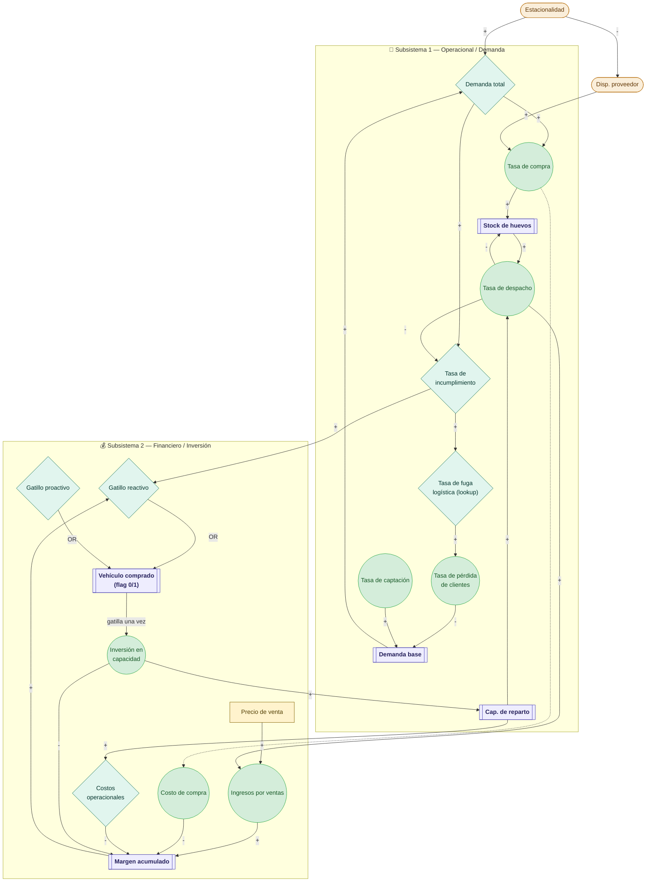
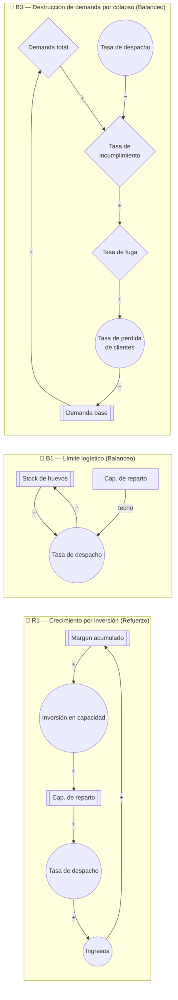

# 🥚 Modelo Dinámica de Sistemas — Distribuidora de Huevos
## Versión adoptada: Tiempo de Inversión con Demanda Creciente y Fuga de Clientes

---

---

## 1. Diagrama Causal (CLD) — corregido



---

## 2. Bucles de retroalimentación



**B3 es el bucle clave de la propuesta** — es un arquetipo de "límites al crecimiento". Con 24 meses de simulación, el primer verano (mes 12-13) genera incumplimiento y empieza a erosionar `Demanda base`; el segundo verano (mes 24) parte con una `Demanda base` ya reducida si no hubo inversión, mostrando el costo acumulado de la inacción.

---

## 3. Variables del modelo — tabla completa con herramienta Vensim

### 3.1 Stocks — Stock Tool (Box Variable / Level)

| Variable | Valor inicial | Unidad | Ecuación INTEG | Descripción |
|----------|:-------------:|--------|-----------------|-------------|
| `Demanda base` | 700 | cajas/mes | `INTEG(Tasa de captacion − Tasa de perdida de clientes, 700)` | Volumen de clientes estables, antes de aplicar estacionalidad |
| `Stock de huevos` | 200 | cajas | `INTEG(Tasa de compra − Tasa de despacho, 200)` | Inventario físico en bodega |
| `Capacidad de reparto` | 867 | cajas/mes | `INTEG(Inversion en capacidad * Incremento cap por CLP, 867)` | Techo logístico de despacho mensual |
| `Margen acumulado` | 0 | CLP | `INTEG(Ingresos por ventas − Costo de compra − Costos operacionales − Inversion en capacidad, 0)` | Caja líquida acumulada |
| **`Vehiculo comprado`** *(nuevo)* | 0 | Dmnl (flag) | `INTEG(Pulso de compra, 0)` | Flag que pasa de 0 a 1 una sola vez cuando se gatilla la inversión — evita que se gaste dinero repetidamente |

### 3.2 Flujos — Flow Tool (Rate)

| Variable | Unidad | Ecuación | Descripción |
|----------|--------|----------|-------------|
| `Tasa de captacion` | cajas/mes/mes | `Demanda base * Tasa crecimiento base` | Crecimiento orgánico mensual de clientes estables |
| `Tasa de perdida de clientes` | cajas/mes/mes | `Demanda base * Tasa de fuga logistica` | Pérdida de clientes por insatisfacción logística |
| `Tasa de compra` | cajas/mes | `Demanda total * Disponibilidad proveedor` | Abastecimiento mensual desde el proveedor |
| `Tasa de despacho` | cajas/mes | `MIN(Capacidad de reparto, Demanda total, Stock de huevos)` | Ventas físicas despachadas. La división por TIME STEP es una salvaguarda numérica de Vensim para que el stock nunca se vuelva negativo en un paso de integración — no es un error de unidades |
| `Ingresos por ventas` | CLP/mes | `Tasa de despacho * Precio de venta` | Entrada financiera mensual |
| `Costo de compra` | CLP/mes | `Tasa de compra * Precio de compra` | Salida financiera por pago al proveedor |
| **`Inversion en capacidad`** *(corregida)* | CLP/mes | `PULSE(Mes de compra, TIME STEP) * Costo de vehiculo / TIME STEP` | Gasta los 5.000.000 **una sola vez**, en el instante exacto en que `Vehiculo comprado` pasa de 0 a 1 — ver detalle en sección 4 |
| **`Pulso de compra`** *(nuevo, auxiliar de flujo)* | Dmnl/mes | `IF THEN ELSE(Gatillo activo = 1 AND Vehiculo comprado = 0, 1, 0)` | Genera el pulso de activación del flag, una sola vez |

### 3.3 Variables auxiliares — Auxiliary Tool

| Variable | Unidad | Ecuación | Descripción |
|----------|--------|----------|-------------|
| `Demanda total` | cajas/mes | `Demanda base * Estacionalidad` | Demanda estacional del mes actual |
| `Tasa de incumplimiento` | Dmnl | `MAX(0, (Demanda total − Tasa de despacho) / Demanda total)` | Fracción de pedidos no entregados |
| `Costos operacionales` | CLP/mes | `Costos fijos mensuales + (Tasa de despacho * Costo variable reparto)` | Costos totales de operación |
| `Costos fijos mensuales` | CLP/mes | `200000 + (Capacidad de reparto − 867) * Costo fijo mantenimiento` | Escala con la capacidad agregada — más realista que un costo fijo plano |
| **`Gatillo reactivo`** *(separado)* | Dmnl (booleano) | `IF THEN ELSE(Margen acumulado > Costo de vehiculo AND Tasa de incumplimiento > 0.1, 1, 0)` | Se activa solo si hay caja Y hay colapso ya ocurriendo |
| **`Gatillo proactivo`** *(separado)* | Dmnl (booleano) | `IF THEN ELSE(Time = Mes de compra, 1, 0)` | Se activa en el mes definido, independiente del estado de caja |
| **`Gatillo activo`** *(combina ambos)* | Dmnl (booleano) | `IF THEN ELSE(Politica proactiva = 1, Gatillo proactivo, Gatillo reactivo)` | Selecciona qué política manda según el escenario simulado |

### 3.4 Lookups — Auxiliary Tool con WITH LOOKUP

| Variable | Tipo | Descripción |
|----------|------|-------------|
| `Tasa de fuga logistica` | Lookup de `Tasa de incumplimiento` | Puntos: `(0,0) (0.1,0.02) (0.3,0.10) (0.5,0.25)` — fuga no lineal, crece más rápido cuando el incumplimiento es severo |
| `Estacionalidad` | Lookup de `Time` | Puntos mensuales (ver sección 5) — repetido en ambos años |
| `Disponibilidad proveedor` | Lookup de `Time` | `(1,0.8) (2,0.8) (3,1.0) (12,1.0)` — repetido en ambos años |

### 3.5 Constantes — Constant Tool

| Constante | Valor | Unidad | Justificación |
|-----------|:-----:|--------|----------------|
| `Tasa crecimiento base` | 0,02 | 1/mes | Crecimiento orgánico mensual estimado — **brecha a validar con datos reales** |
| `Precio de venta` | 11.500 | CLP/caja | Calibrar contra datos reales 2025 si están disponibles |
| `Precio de compra` | 9.000 | CLP/caja | Calibrar contra datos reales 2025 |
| `Costo de vehiculo` | 5.000.000 | CLP | Estimado de mercado para vehículo de reparto adicional |
| `Incremento cap por CLP` | 0,0001 | (cajas/mes)/CLP | Traduce 5.000.000 CLP en 500 cajas/mes adicionales de capacidad |
| `Costo variable reparto` | 500 | CLP/caja | Combustible, peajes por caja despachada |
| `Costo fijo mantenimiento` | 200 | CLP/caja/mes | Sueldo chofer + mantención, prorrateado por capacidad agregada |
| **`Mes de compra`** *(nuevo)* | 6 (proactivo) | mes | Mes en que se activa la compra si la política es proactiva |
| `Politica proactiva` | 0 ó 1 | Dmnl | Bandera de escenario: 0 = reactivo/base, 1 = proactivo |

---

## 4. Detalle de la corrección del gasto repetido (el error más importante)

**Por qué era un error:** en la propuesta original, `Inversión en capacidad` se recalculaba cada mes a partir de `Gatillo inversion`. Si la política era proactiva, `STEP(1,6)` sube a 1 en el mes 6 y **nunca vuelve a bajar** — Vensim seguiría ejecutando `Costo_de_vehiculo / TIME STEP` en cada paso posterior, gastando 5 millones mensuales indefinidamente.

**Cómo se corrige:** se agrega el stock `Vehiculo comprado`, que solo puede pasar de 0 a 1 una vez. El flujo `Inversion en capacidad` se activa únicamente en el instante en que ese cambio ocurre:

```
Vehiculo comprado = INTEG( Pulso de compra, 0 )
    UNITS: Dmnl

Pulso de compra =
    IF THEN ELSE( Gatillo activo = 1 :AND: Vehiculo comprado < 1, 1 / TIME STEP, 0 )
    UNITS: Dmnl/mes

Inversion en capacidad =
    Pulso de compra * Costo de vehiculo
    UNITS: CLP/mes
```

Con esto, en el paso de integración donde se activa el gatillo, `Pulso de compra` vale `1/TIME STEP` exactamente durante ese paso, lo que multiplicado por `TIME STEP` en la integración entrega los 5.000.000 CLP completos **una sola vez**. En el paso siguiente, `Vehiculo comprado` ya es 1, así que `Pulso de compra` vuelve a 0 y el gasto no se repite.

---

## 5. Ecuaciones completas para Vensim

```
════════════════════════════════════════════════════════════
 CONTROL DE SIMULACIÓN
════════════════════════════════════════════════════════════

INITIAL TIME = 0      UNITS: mes
FINAL TIME   = 24     UNITS: mes   (2 años → 2 veranos)
TIME STEP    = 1      UNITS: mes
SAVEPER      = TIME STEP

════════════════════════════════════════════════════════════
 STOCKS
════════════════════════════════════════════════════════════

Demanda base = INTEG( Tasa de captacion - Tasa de perdida de clientes, 700 )
    UNITS: cajas/mes

Stock de huevos = INTEG( Tasa de compra - Tasa de despacho, 900 )
    UNITS: cajas

Capacidad de reparto = INTEG( Inversion en capacidad * Incremento cap por CLP, 720 )
    UNITS: cajas/mes

Margen acumulado = INTEG(
    Ingresos por ventas - (Costo de compra + Costos operacionales + Inversion en capacidad),
    12000000 )
    UNITS: CLP

Vehiculo comprado = INTEG( Pulso de compra, 0 )
    UNITS: Dmnl
Tiempo = INTEG(
    1,0
)


════════════════════════════════════════════════════════════
 FLUJOS
════════════════════════════════════════════════════════════

Tasa de captacion =
    Demanda base * Tasa crecimiento base
    UNITS: cajas/mes/mes

Tasa de perdida de clientes =
    IF THEN ELSE(Demanda Base > Demanda minima, Demanda Base * Tasa de fuga logistica, 0)
    UNITS: cajas/mes/mes

Tasa de compra =
    MIN(Necesidad de compra, Disponibilidad proveedor * Capacidad maxima proveedor)
    UNITS: cajas/mes

Tasa de despacho =
    MIN( Capacidad Reparto, MIN( Demanda total, Stock de huevos/ Paso de tiempo) )
    UNITS: cajas/mes

Ingresos por ventas =
    Tasa de despacho * Precio de venta
    UNITS: CLP/mes

Costo de compra =
    Tasa de compra * Precio de compra
    UNITS: CLP/mes

Pulso de compra =
    IF THEN ELSE(
        Gatillo Activo = 1 :AND: Vehiculo comprado < 1,
        1/Paso de tiempo,
        0 )
    UNITS: Dmnl/mes

Inversion en capacidad =
    Pulso de compra * Costo de vehiculo
    UNITS: CLP/mes

════════════════════════════════════════════════════════════
 VARIABLES AUXILIARES
════════════════════════════════════════════════════════════

Demanda total =
    Demanda base * Estacionalidad
    UNITS: cajas/mes

Tasa de incumplimiento =
    MAX( 0, (Demanda total - Tasa de despacho) / Demanda total )
    UNITS: Dmnl

Costos fijos mensuales =
    200000 + (Capacidad de reparto - 867) * Costo fijo mantenimiento
    UNITS: CLP/mes

Costos operacionales =
    Costos fijos mensuales + (Tasa de despacho * Costo variable reparto)
    UNITS: CLP/mes

Gatillo reactivo =
    IF THEN ELSE(
            Margen acumulado > Costo del Vehiculo :AND: Tasa de incumplimiento > 0.1,
            1, 0 )
    UNITS: Dmnl

Gatillo proactivo =
    IF THEN ELSE(Tiempo >= Mes de compra, 1, 0)
    UNITS: Dmnl

Gatillo activo =
    IF THEN ELSE( Politica proactiva = 1, Gatillo proactivo, Gatillo reactivo )
    UNITS: Dmnl

Necesidad de compra =
    MAX(0, Inventario Objetivo - Stock de huevos)
    UNITS: Dmnl


════════════════════════════════════════════════════════════
 LOOKUPS
════════════════════════════════════════════════════════════

Tasa de fuga logistica( Tasa de incumplimiento ) =
    WITH LOOKUP( Tasa de incumplimiento,
    ([(0,0)-(0.5,0.3)],(0,0), (0.1,0.02), (0.3,0.1), (0.5,0.25), (0.7,0.3), (1,0.32)))
    UNITS: Dmnl

Estacionalidad = WITH LOOKUP( MODULO ( Tiempo , 12 ),
    ([(0,0)-(24,2)],(0,1.84), (1,1.81), (2,0.84), (3,0.78), (4,0.9), (5,0.75), (6,0.84), (7,0.67), (8,0.69), (9,0.91), (10,0.71), (11,1.27))
    )
    UNITS: Dmnl

Disponibilidad proveedor = WITH LOOKUP( MODULO ( Tiempo , 12 ),
    ([(0,0)-(25,1.1)],
    (0,0.8),(1,0.8),(2,1.0),(3,1.0),(4,1.0),(5,1.0),
    (6,1.0),(7,1.0),(8,1.0),(9,1.0),(10,1.0),(11,1.0),
    (12,0.8),(13,0.8),(14,1.0),(15,1.0),(16,1.0),(17,1.0),
    (18,1.0),(19,1.0),(20,1.0),(21,1.0),(22,1.0),(23,1.0),
    (24,0.8)) )
    UNITS: Dmnl

════════════════════════════════════════════════════════════
 CONSTANTES
════════════════════════════════════════════════════════════

Tasa crecimiento base   = 0.02       UNITS: 1/mes
Precio de venta         = 33000      UNITS: CLP/caja
Precio de compra        = 24000       UNITS: CLP/caja
Costo de vehiculo       = 5000000    UNITS: CLP
Incremento cap por CLP  = 0,00004328     UNITS: (cajas/mes)/CLP
Costo variable reparto  = 500        UNITS: CLP/caja
Costo fijo mantenimiento = 200       UNITS: CLP/caja/mes
Mes de compra           = 8          UNITS: mes
Politica proactiva      = 1          UNITS: Dmnl   (0 = Base/Reactivo, 1 = Proactivo)
Inventario Objetivo     = 1300       UNITS: Caja
Paso de tiempo          = 1          UNITS: mes
```

---

## 6. Escenarios de simulación

| Escenario | `Politica proactiva` | `Mes de compra` | Comportamiento esperado |
|-----------|:---------------------:|:----------------:|---------------------------|
| **Base (sin inversión)** | 0, y además fijar `Gatillo activo = 0` manualmente o `Costo de vehiculo` a un valor inalcanzable | — | Capacidad fija en 867. Primer verano genera incumplimiento, fuga de clientes reduce `Demanda base`. Segundo verano colapsa con una base de clientes ya reducida |
| **Reactivo** | 0 | — (se activa solo) | Espera a que `Margen acumulado > 5.000.000` Y `Tasa de incumplimiento > 0.1`. Sufre fuga de clientes antes de invertir, luego recupera capacidad |
| **Proactivo** | 1 | 6 | Invierte en el mes 6, antes del primer verano. Si `Margen acumulado` aún no alcanza los 5 millones, el modelo igual ejecuta el pulso (representa el uso de crédito mencionado en la propuesta) — protege la demanda base al 100% |

> **Nota para la presentación:** para el escenario Base puro (sin ninguna inversión, ni siquiera reactiva), la forma más limpia es duplicar el modelo y eliminar la rama de inversión, o fijar `Costo de vehiculo` artificialmente alto (ej. 999.999.999) para que el gatillo reactivo nunca se cumpla. Ambas son prácticas aceptadas en Vensim para aislar escenarios.

---

## 7. Trazabilidad de variables — verificación rápida antes de correr Check Model

| Variable | Alimenta a | Es alimentada por |
|----------|------------|---------------------|
| `Tasa crecimiento base` | `Tasa de captacion` | — |
| `Demanda base` | `Tasa de captacion`, `Tasa de perdida de clientes`, `Demanda total` | `Tasa de captacion`, `Tasa de perdida de clientes` (INTEG) |
| `Estacionalidad` | `Demanda total` | Time (lookup) |
| `Demanda total` | `Tasa de compra`, `Tasa de incumplimiento` | `Demanda base`, `Estacionalidad` |
| `Disponibilidad proveedor` | `Tasa de compra` | Time (lookup) |
| `Tasa de compra` | `Stock de huevos`, `Costo de compra` | `Demanda total`, `Disponibilidad proveedor` |
| `Stock de huevos` | `Tasa de despacho` | `Tasa de compra`, `Tasa de despacho` (INTEG) |
| `Capacidad de reparto` | `Tasa de despacho`, `Costos fijos mensuales` | `Inversion en capacidad` (INTEG) |
| `Tasa de despacho` | `Stock de huevos`, `Ingresos`, `Tasa de incumplimiento`, `Costos operacionales` | `Capacidad de reparto`, `Demanda total`, `Stock de huevos` |
| `Tasa de incumplimiento` | `Tasa de fuga logistica`, `Gatillo reactivo` | `Demanda total`, `Tasa de despacho` |
| `Tasa de fuga logistica` | `Tasa de perdida de clientes` | `Tasa de incumplimiento` (lookup) |
| `Precio de venta` | `Ingresos por ventas` | — |
| `Ingresos por ventas` | `Margen acumulado` | `Tasa de despacho`, `Precio de venta` |
| `Precio de compra` | `Costo de compra` | — |
| `Costo de compra` | `Margen acumulado` | `Tasa de compra`, `Precio de compra` |
| `Costo fijo mantenimiento` | `Costos fijos mensuales` | — |
| `Costos fijos mensuales` | `Costos operacionales` | `Capacidad de reparto`, `Costo fijo mantenimiento` |
| `Costo variable reparto` | `Costos operacionales` | — |
| `Costos operacionales` | `Margen acumulado` | `Costos fijos mensuales`, `Tasa de despacho`, `Costo variable reparto` |
| `Costo de vehiculo` | `Gatillo reactivo`, `Inversion en capacidad` | — |
| `Margen acumulado` | `Gatillo reactivo` | `Ingresos`, `Costo de compra`, `Costos operacionales`, `Inversion en capacidad` (INTEG) |
| `Mes de compra` | `Gatillo proactivo` | — |
| `Politica proactiva` | `Gatillo activo` | — |
| `Gatillo reactivo`, `Gatillo proactivo` | `Gatillo activo` | `Margen acumulado`, `Tasa de incumplimiento`, `Costo de vehiculo`, `Time`, `Mes de compra` |
| `Gatillo activo` | `Pulso de compra` | `Politica proactiva`, `Gatillo reactivo`, `Gatillo proactivo` |
| `Vehiculo comprado` | `Pulso de compra` | `Pulso de compra` (INTEG) |
| `Pulso de compra` | `Vehiculo comprado`, `Inversion en capacidad` | `Gatillo activo`, `Vehiculo comprado` |
| `Incremento cap por CLP` | `Capacidad de reparto` | — |
| `Inversion en capacidad` | `Margen acumulado`, `Capacidad de reparto` | `Pulso de compra`, `Costo de vehiculo` |

---

## 8. Herramienta Vensim por variable — resumen rápido

| Herramienta | Variables |
|-------------|-----------|
| **Stock / Box Variable (Level)** | `Demanda base`, `Stock de huevos`, `Capacidad de reparto`, `Margen acumulado`, `Vehiculo comprado` |
| **Rate / Flow** | `Tasa de captacion`, `Tasa de perdida de clientes`, `Tasa de compra`, `Tasa de despacho`, `Ingresos por ventas`, `Costo de compra`, `Pulso de compra`, `Inversion en capacidad` |
| **Auxiliary** | `Demanda total`, `Tasa de incumplimiento`, `Costos fijos mensuales`, `Costos operacionales`, `Gatillo reactivo`, `Gatillo proactivo`, `Gatillo activo` |
| **Auxiliary con WITH LOOKUP** | `Tasa de fuga logistica`, `Estacionalidad`, `Disponibilidad proveedor` |
| **Constant** | `Tasa crecimiento base`, `Precio de venta`, `Precio de compra`, `Costo de vehiculo`, `Incremento cap por CLP`, `Costo variable reparto`, `Costo fijo mantenimiento`, `Mes de compra`, `Politica proactiva` |

---

## 9. Brechas de información pendientes (heredadas de la propuesta original)

1. **Tasa de fuga real de clientes** — el lookup actual es una estimación razonable pero no calibrada con datos del negocio. Si tienen registros de clientes que dejaron de comprar tras un atraso, esto se puede ajustar.
2. **Crecimiento orgánico mensual (2%)** — verificar contra el historial de clientes nuevos fuera de temporada alta.
3. **Costo real de chofer/mantención adicional** — ajustar `Costo fijo mantenimiento` con una cotización real de la zona.

---

*Modelo basado en la propuesta del compañero, con correcciones técnicas para evitar gasto repetido de inversión y horizonte de simulación extendido a 24 meses.*
*Proyecto final — Teoría de Sistemas.*