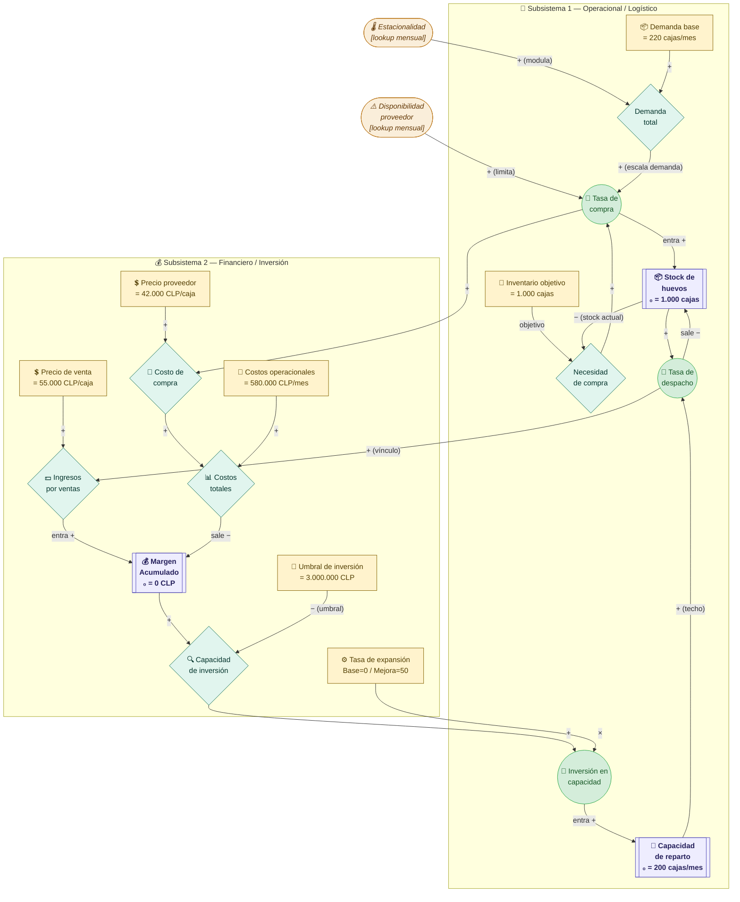
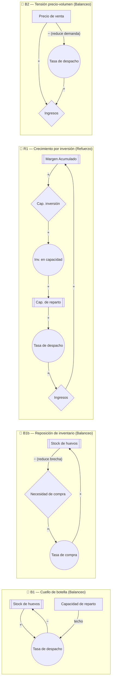

# 🥚 Modelo Dinámica de Sistemas — Distribuidora de Huevos
## Diagrama de Forrester + Parámetros del Modelo

---

## 1. Diagrama de Forrester (Vensim-style en Mermaid)

> **Convención visual:**
> - 🟦 `[[ ]]` → **Stock / Nivel** (rectángulo doble)
> - `(( ))` → **Flujo** (válvula/flecha gruesa)
> - `{ }` → **Variable auxiliar**
> - `[ ]` → **Parámetro / Constante**
> - borde naranja → **Variable exógena**



---

## 2. Bucles de retroalimentación



---

## 3. Variables del modelo — Tabla completa

### 3.1 Stocks (Niveles) — Stock Tool en Vensim

| Variable | Valor inicial | Unidad | Ecuación INTEG | Descripción |
|----------|:-------------:|--------|----------------|-------------|
| `Stock de huevos` | 1.000 | cajas | `INTEG(Tasa de compra − Tasa de despacho, 1000)` | Inventario físico en bodega |
| `Margen Acumulado` | 0 | CLP | `INTEG(Ingresos − Costos totales, 0)` | Rentabilidad acumulada del negocio |
| `Capacidad de reparto` | 200 | cajas/mes | `INTEG(Inversion en capacidad, 200)` | Variable principal — techo operacional del sistema |

### 3.2 Flujos — Flow Tool en Vensim

| Variable | Unidad | Ecuación | Descripción |
|----------|--------|----------|-------------|
| `Tasa de compra` | cajas/mes | `MIN(Necesidad de compra, Disponibilidad proveedor * Demanda total)` | Compra limitada por brecha de inventario Y disponibilidad del proveedor |
| `Tasa de despacho` | cajas/mes | `MIN(Stock de huevos, Capacidad de reparto)` | Despacho limitado por stock Y capacidad de reparto |
| `Ingresos` | CLP/mes | `Tasa de despacho * Precio de venta` | Ingresos brutos por ventas del período |
| `Costos totales` | CLP/mes | `Costo de compra + Costos operacionales` | Egresos totales del período |
| `Inversion en capacidad` | cajas/mes/mes | `Capacidad de inversion * Tasa de expansion` | Flujo de expansión de capacidad cuando se activa |

### 3.3 Variables auxiliares — Variable Tool en Vensim

| Variable | Unidad | Ecuación | Descripción |
|----------|--------|----------|-------------|
| `Demanda total` | cajas/mes | `Demanda base * Estacionalidad` | Demanda real modulada por época del año |
| `Necesidad de compra` | cajas | `MAX(0, Inventario objetivo − Stock de huevos)` | Brecha entre stock actual y objetivo — activa la compra |
| `Costo de compra` | CLP/mes | `Tasa de compra * Precio proveedor` | Gasto mensual en adquisición |
| `Capacidad de inversion` | Dmnl | `IF THEN ELSE(Margen Acumulado > Umbral de inversion, 1, 0)` | Indicador binario: ¿hay margen para invertir? |
| `Estacionalidad` | Dmnl | `WITH LOOKUP(Time, ...)` | Índice estacional mensual — ver tabla sección 3.5 |
| `Disponibilidad proveedor` | Dmnl | `WITH LOOKUP(Time, ...)` | Fracción de demanda que el proveedor puede surtir |

### 3.4 Constantes — Constant Tool en Vensim

| Constante | Valor base | Valor mejora | Unidad | Justificación |
|-----------|:----------:|:------------:|--------|---------------|
| `Demanda base` | 220 | 220 | cajas/mes | Calibrado desde ventas 2025 fuera de temporada |
| `Inventario objetivo` | 1.000 | 1.000 | cajas | Nivel de stock deseado — activa el pedido cuando hay brecha |
| `Precio de venta` | 55.000 | 60.000 | CLP/caja | Estimado: ventas totales 2025 / volumen anual |
| `Precio proveedor` | 42.000 | 42.000 | CLP/caja | Estimado: compras totales 2025 / volumen anual |
| `Costos operacionales` | 580.000 | 780.000 | CLP/mes | Estimado basado en márgenes 2025; mejora suma personal extra |
| `Umbral de inversion` | 3.000.000 | 3.000.000 | CLP | ≈ costo vehículo de reparto usado |
| `Tasa de expansion` | **0** | **50** | cajas/mes/mes | 0 = sin inversión nueva; 50 = compra vehículo + personal |

### 3.5 Lookups — Variable Tool con WITH LOOKUP en Vensim

#### Estacionalidad

| Time (mes) | Índice | Mes calendario |
|:----------:|:------:|----------------|
| 0 | 1,80 | Enero (año 1) |
| 1 | 1,70 | Febrero |
| 2 | 0,80 | Marzo |
| 3 | 0,70 | Abril |
| 4 | 0,80 | Mayo |
| 5 | 0,70 | Junio |
| 6 | 0,75 | Julio |
| 7 | 0,60 | Agosto |
| 8 | 0,65 | Septiembre |
| 9 | 0,85 | Octubre |
| 10 | 0,75 | Noviembre |
| 11 | 1,20 | Diciembre |
| 12 | 1,80 | Enero (año 2) |
| 13 | 1,70 | Febrero |
| 14 | 0,80 | Marzo |
| ... | ... | (repite patrón) |
| 23 | 0,75 | Noviembre |
| 24 | 1,20 | Diciembre |

#### Disponibilidad del proveedor

| Time (mes) | Fracción | Observación |
|:----------:|:--------:|-------------|
| 0–1 | 0,80 | Enero–Febrero año 1: −20% verano |
| 2–10 | 1,00 | Marzo–Noviembre: disponibilidad normal |
| 11 | 0,90 | Diciembre: inicio restricción |
| 12–13 | 0,80 | Enero–Febrero año 2: −20% verano |
| 14–22 | 1,00 | Marzo–Noviembre: disponibilidad normal |
| 23 | 1,00 | Noviembre |
| 24 | 0,90 | Diciembre año 2 |

---

## 4. Ecuaciones completas para ingresar en Vensim

```
════════════════════════════════════════════════════════════
 STOCKS
════════════════════════════════════════════════════════════

Stock de huevos = INTEG( Tasa de compra - Tasa de despacho, 1000 )
    UNITS: cajas

Margen Acumulado = INTEG( Ingresos - Costos totales, 0 )
    UNITS: CLP

Capacidad de reparto = INTEG( Inversion en capacidad, 200 )
    UNITS: cajas/mes

════════════════════════════════════════════════════════════
 FLUJOS
════════════════════════════════════════════════════════════

Tasa de compra =
    MIN(
        Necesidad de compra,
        Disponibilidad proveedor * Demanda total
    )
    UNITS: cajas/mes

Tasa de despacho =
    MIN( Stock de huevos, Capacidad de reparto )
    UNITS: cajas/mes

Ingresos =
    Tasa de despacho * Precio de venta
    UNITS: CLP/mes

Costos totales =
    Costo de compra + Costos operacionales
    UNITS: CLP/mes

Inversion en capacidad =
    Capacidad de inversion * Tasa de expansion
    UNITS: cajas/mes/mes

════════════════════════════════════════════════════════════
 VARIABLES AUXILIARES
════════════════════════════════════════════════════════════

Demanda total =
    Demanda base * Estacionalidad
    UNITS: cajas/mes

Necesidad de compra =
    MAX( 0, Inventario objetivo - Stock de huevos )
    UNITS: cajas

Costo de compra =
    Tasa de compra * Precio proveedor
    UNITS: CLP/mes

Capacidad de inversion =
    IF THEN ELSE( Margen Acumulado > Umbral de inversion, 1, 0 )
    UNITS: Dmnl

════════════════════════════════════════════════════════════
 CONSTANTES
════════════════════════════════════════════════════════════

Inventario objetivo   = 1000       UNITS: cajas
Demanda base          = 220        UNITS: cajas/mes
Precio de venta       = 55000      UNITS: CLP/caja
Precio proveedor      = 42000      UNITS: CLP/caja
Costos operacionales  = 580000     UNITS: CLP/mes
Umbral de inversion   = 3000000    UNITS: CLP
Tasa de expansion     = 0          UNITS: cajas/mes/mes
    ↑ Cambiar a 50 en escenario de mejora

════════════════════════════════════════════════════════════
 LOOKUPS
════════════════════════════════════════════════════════════

Estacionalidad = WITH LOOKUP( Time,
    ([(0,0)-(25,3)],
    (0,1.8),(1,1.7),(2,0.8),(3,0.7),(4,0.8),(5,0.7),
    (6,0.75),(7,0.6),(8,0.65),(9,0.85),(10,0.75),(11,1.2),
    (12,1.8),(13,1.7),(14,0.8),(15,0.7),(16,0.8),(17,0.7),
    (18,0.75),(19,0.6),(20,0.65),(21,0.85),(22,0.75),(23,1.2),
    (24,1.8))
)
    UNITS: Dmnl

Disponibilidad proveedor = WITH LOOKUP( Time,
    ([(0,0)-(25,1.1)],
    (0,0.8),(1,0.8),(2,1),(3,1),(4,1),(5,1),
    (6,1),(7,1),(8,1),(9,1),(10,1),(11,0.9),
    (12,0.8),(13,0.8),(14,1),(15,1),(16,1),(17,1),
    (18,1),(19,1),(20,1),(21,1),(22,1),(23,0.9),
    (24,0.8))
)
    UNITS: Dmnl

════════════════════════════════════════════════════════════
 CONTROL DE SIMULACIÓN
════════════════════════════════════════════════════════════

INITIAL TIME  = 0       UNITS: mes
FINAL TIME    = 24      UNITS: mes    (2 años: 2025–2026)
TIME STEP     = 0.25    UNITS: mes
SAVEPER       = TIME STEP
```

---

## 5. Lógica de compra — Cómo funciona el nuevo esquema

El ajuste que hiciste introduce un **bucle de balanceo de inventario (B1b)** que hace el modelo más realista:

```
Inventario objetivo (1.000 cajas)
        │
        │  − Stock de huevos actual
        ▼
Necesidad de compra = MAX(0, 1000 − Stock)
        │
        │  limitada por disponibilidad del proveedor
        ▼
Tasa de compra = MIN(Necesidad, Disp.proveedor × Demanda total)
        │
        ▼
Stock de huevos ↑
```

**Diferencia respecto al modelo anterior:**

| Aspecto | Modelo anterior | Modelo actual |
|---------|----------------|---------------|
| ¿Qué activa la compra? | La demanda total directamente | La **brecha** entre stock objetivo y stock real |
| Comportamiento | Compra proporcional a demanda | Compra reactiva cuando el stock cae bajo 1.000 |
| Bucle adicional | — | B1b: reposición de inventario (balanceo) |
| Realismo | Moderado | **Alto** — replica cómo opera el negocio real |

---

## 6. Escenarios de simulación

### Escenario Base — sin intervención

| Parámetro | Valor |
|-----------|-------|
| `Tasa de expansion` | **0** |
| `Precio de venta` | 55.000 CLP/caja |
| `Costos operacionales` | 580.000 CLP/mes |

Comportamiento esperado: stock oscila cerca de 1.000, la capacidad de reparto no crece, el margen se acumula lentamente y en verano el despacho queda limitado por los 200 cajas/mes.

### Escenario de Mejora — inversión en vehículo y personal

| Parámetro | Valor base → Nuevo |
|-----------|--------------------|
| `Tasa de expansion` | 0 → **50** |
| `Precio de venta` | 55.000 → **60.000** |
| `Costos operacionales` | 580.000 → **780.000** |

Comportamiento esperado: en cuanto el margen supera 3.000.000 CLP se activa la inversión, la capacidad de reparto crece, en verano se despacha más y el bucle R1 se vuelve dominante.

---

## 7. Herramienta por variable — resumen rápido

| Herramienta Vensim | Variables |
|--------------------|-----------|
| **Stock Tool** (rectángulo) | `Stock de huevos`, `Margen Acumulado`, `Capacidad de reparto` |
| **Flow Tool** (válvula) | `Tasa de compra`, `Tasa de despacho`, `Ingresos`, `Costos totales`, `Inversion en capacidad` |
| **Variable Tool** (óvalo, con ecuación) | `Demanda total`, `Necesidad de compra`, `Costo de compra`, `Capacidad de inversion`, `Estacionalidad`, `Disponibilidad proveedor` |
| **Constant Tool** (óvalo, solo número) | `Inventario objetivo`, `Demanda base`, `Precio de venta`, `Precio proveedor`, `Costos operacionales`, `Umbral de inversion`, `Tasa de expansion` |

---

*Modelo calibrado con datos reales de operación 2025 de la distribuidora.*  
*Proyecto final — Teoría de Sistemas.*