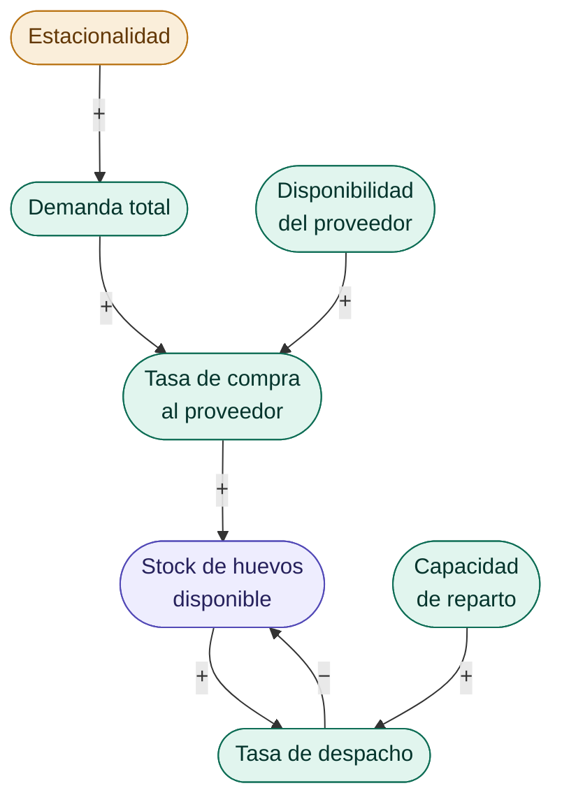
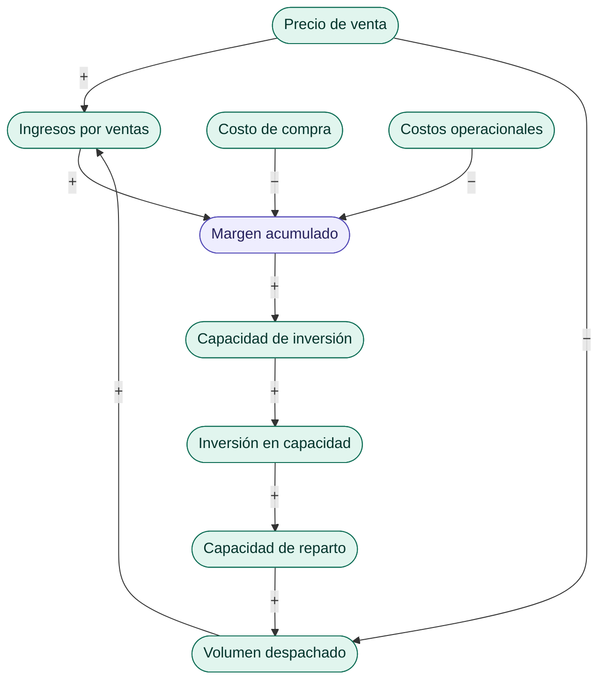
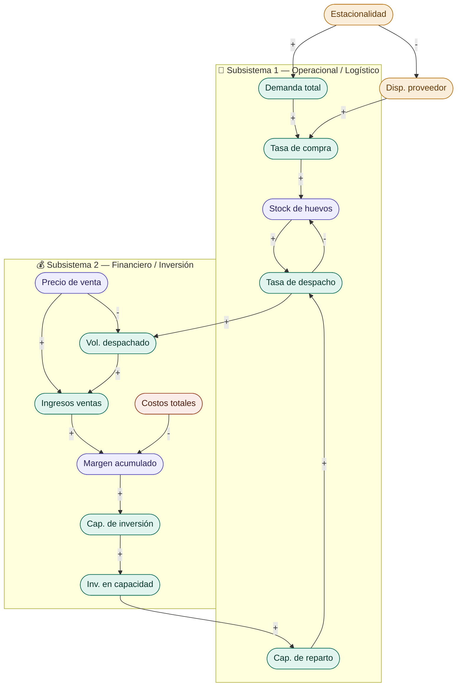

# 🥚 Propuesta de Proyecto — Dinámica de Sistemas en una Distribuidora de Huevos

[← Volver al README principal](../../../README.md)

## El problema

Una distribuidora de huevos de pequeña escala abastece actualmente a:

- 2 supermercados de la zona
- Restoranes locales
- Almacenes de población
- Un nuevo punto de venta al por menor (reciente)

**El problema central:** en temporada de verano, la demanda aumenta significativamente, pero la capacidad operacional no escala al mismo ritmo. Esto genera un cuello de botella que impide captar nuevos clientes y, en algunos casos, compromete el servicio a los actuales.

A esto se suma que en los últimos dos veranos consecutivos se han registrado problemas de disponibilidad (por parte del proveedor), precisamente cuando más se necesita el producto.

La pregunta que guía el modelo es:

> **¿Cuándo conviene invertir en más capacidad (vehículo, personal) y cómo afecta esa decisión la rentabilidad del negocio en el tiempo?**

---

## Subsistemas identificados

El sistema se divide en dos subsistemas claramente diferenciados, cumpliendo el requisito mínimo del proyecto:

### 🚛 Subsistema 1 — Operacional / Logístico

Agrupa las variables relacionadas con el flujo físico del negocio: desde la compra de huevos al proveedor hasta la entrega al cliente final.

| Variable | Descripción |
|----------|-------------|
| Stock de huevos disponible | Nivel de inventario en bodega |
| Tasa de compra al proveedor | Cajas adquiridas por período |
| Disponibilidad del proveedor | Afectada estacionalmente en verano |
| Tasa de despacho | Volumen entregado por período |
| Capacidad de reparto | Vehículo propio + apoyo externo (camión familiar) |
| Demanda total | Suma de todos los canales de venta |
| Estacionalidad | Factor que modula demanda y disponibilidad según época del año |

**Convenciones:**
- **(+)** — si la variable origen aumenta, la variable destino también aumenta
- **(−)** — si la variable origen aumenta, la variable destino disminuye
- **Ámbar** — variable exógena (el sistema no la controla)
- **Verde** — variable endógena del sistema
- **Púrpura** — stock (nivel de inventario que se acumula y drena)

**Bucle B1 — cuello de botella (balanceo):**
`Stock → Tasa de despacho → Stock`
Cada despacho consume inventario, lo que limita el despacho siguiente. En verano, la demanda sube pero el stock no escala al mismo ritmo, saturando el sistema.

**Supuesto:** Se asume que en temporada de verano la disponibilidad del proveedor tiende a disminuir, basado en experiencia de dos períodos consecutivos. Esta relación no está representada en el diagrama causal pero se considera en los supuestos del modelo.
` ``

### 💰 Subsistema 2 — Financiero / Inversión

Agrupa las variables relacionadas con ingresos, costos y la decisión de invertir para crecer.

| Variable | Descripción |
|----------|-------------|
| Ingresos por ventas | Función del volumen despachado y precio |
| Precio de venta | Variable con posibilidad de ajuste estacional |
| Costo de compra | Precio del proveedor por caja |
| Costos operacionales | Combustible, personal, arriendo del punto de venta |
| Margen acumulado | Diferencia entre ingresos y costos en el tiempo |
| Capacidad de inversión | Umbral de margen que habilita una decisión de inversión |
| Inversión en capacidad | Compra de vehículo o contratación de personal |

**Convenciones:**
- **(+)** — si la variable origen aumenta, la variable destino también aumenta
- **(−)** — si la variable origen aumenta, la variable destino disminuye
- **Verde** — variable endógena del sistema
- **Púrpura** — stock o acumulador del sistema

**Bucle R1 — crecimiento por inversión (refuerzo):**
`Margen acumulado → Inversión en capacidad → Capacidad de reparto → Volumen despachado → Ingresos por ventas → Margen acumulado`
Cada mejora en la capacidad permite atender más volumen, lo que eleva los ingresos y puede seguir alimentando nuevas inversiones.

**Bucle B2 — tensión precio-volumen (balanceo):**
`Aumento de precio de venta → Reducción de volumen despachado → Menor ingreso total`
Si el precio sube demasiado, parte de la demanda puede caer, reduciendo los ingresos finales pese al mayor precio unitario.

> Total: **14 variables** → cumple holgadamente el mínimo de 10 exigido.

---

# Diagrama Causal — Distribuidora de Huevos
 

 
**Convenciones:**
- **(+)** relación positiva: si la variable origen aumenta, el destino también aumenta
- **(−)** relación negativa: si la variable origen aumenta, el destino disminuye
- 🟡 **Ámbar** — variable exógena (el sistema no la controla)
- 🟢 **Verde** — flujo o variable auxiliar endógena
- 🟣 **Púrpura** — stock o parámetro
- 🔴 **Coral** — costos

## Bucles de retroalimentación

El sistema tiene al menos tres bucles identificables, cumpliendo el requisito mínimo:

### ➕ Bucle R1 — Crecimiento por inversión (Refuerzo)
Margen acumulado → Inversión en capacidad → Capacidad de reparto → Volumen despachado → Ingresos por ventas → Margen acumulado

### ➖ Bucle B1 — Cuello de botella operacional (Balanceo)
Aumento de demanda → Stock insuficiente o capacidad de reparto saturada → Pedidos no atendidos → Pérdida de clientes → Menor ingreso

### ➖ Bucle B2 — Tensión precio-volumen (Balanceo)
Aumento de precio de venta → Reducción de volumen despachado → Menor ingreso total

---

## Escenarios de simulación

| Escenario | Descripción |
|-----------|-------------|
| **Base** | Operación actual: sin inversión nueva, usando el camión familiar como parche en verano, precio fijo |
| **Mejora** | Compra de vehículo propio + contratación de personal en temporada alta + ajuste de precio en verano |

La comparación permite responder: *¿en cuántos períodos se recupera la inversión y a partir de cuándo es más rentable que la situación actual?*

---

## Estructura del informe (check de requisitos)

| Sección requerida | ¿Cubierta? |
|------------------|-----------|
| Portada | ✅ |
| Resumen | ✅ |
| Introducción | ✅ |
| Definiciones y marco teórico | ✅ |
| Definición del problema | ✅ — problema real con contexto documentable |
| Identificación de subsistemas | ✅ — 2 subsistemas definidos |
| Identificación de variables | ✅ — 14 variables identificadas |
| Influencias de 1°, 2° y 3° orden | ✅ |
| Diagrama causal | ✅ |
| Bucles de retroalimentación | ✅ — 3 bucles identificados |
| Datos históricos y supuestos | ✅ — datos reales del negocio + fuentes de precios de mercado |
| Diagrama de Forrester | ✅ |
| Construcción del modelo | ✅ |
| Simulación escenario base | ✅ |
| Propuesta de intervención | ✅ — inversión en vehículo y personal |
| Simulación escenario de mejora | ✅ |
| Resultados | ✅ |
| Conclusiones | ✅ |
| Referencias APA 7 | ✅ |

> **Todo el esqueleto del informe está cubierto desde el diseño del problema.**

---

## Herramienta de simulación sugerida

Se propone usar **Python** (con librerías `numpy` y `matplotlib`) o **Vensim** para la simulación, ambas aceptadas por el enunciado. Python tiene la ventaja de que el modelo queda como un script reutilizable para el negocio real.

---

## 📂 Datos históricos del negocio
 
Los registros reales de compras y ventas del negocio (octubre 2024 – mayo 2026) están disponibles en el siguiente documento, y sirven como base para calibrar los valores iniciales del modelo:
 
> 📊 **[Ver datos históricos de compras, ventas y ganancia líquida →](./DATOS_HISTORICOS.md)**
 
Incluye:
- Montos mensuales de compra al proveedor (con y sin IVA)
- Montos mensuales de venta (con y sin IVA)
- Ganancia líquida mensual
- Observaciones sobre estacionalidad y variabilidad del margen
---

## Próximos pasos si se aprueba la propuesta

1. Levantar los datos históricos disponibles (volúmenes, precios, costos)
2. Definir valores iniciales de cada variable 
3. Construir el diagrama causal y de Forrester
4. Implementar el modelo en Python o Vensim
5. Correr los dos escenarios y analizar resultados

---

> _Propuesta elaborada para discusión grupal previa a la entrega del 29 de mayo._