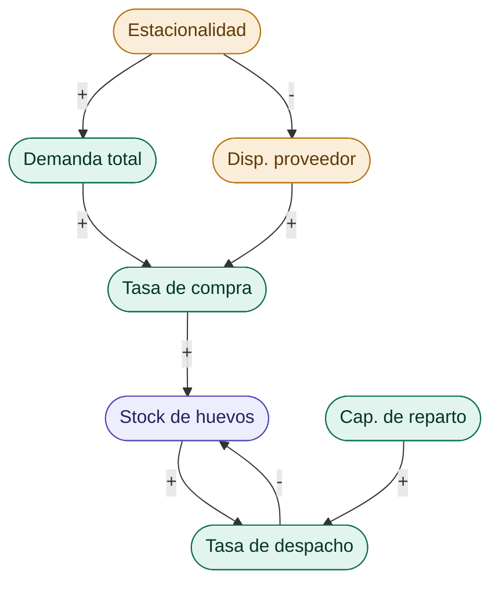
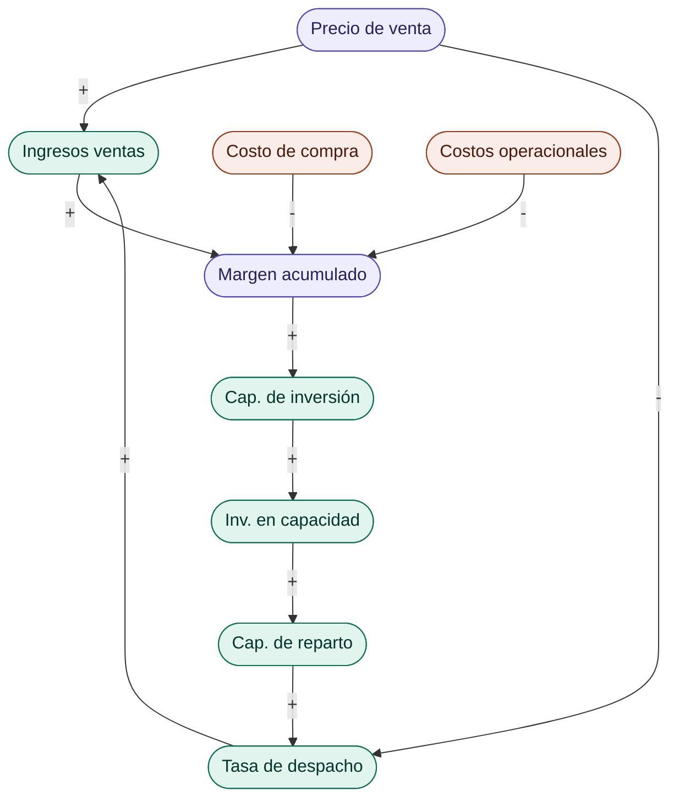
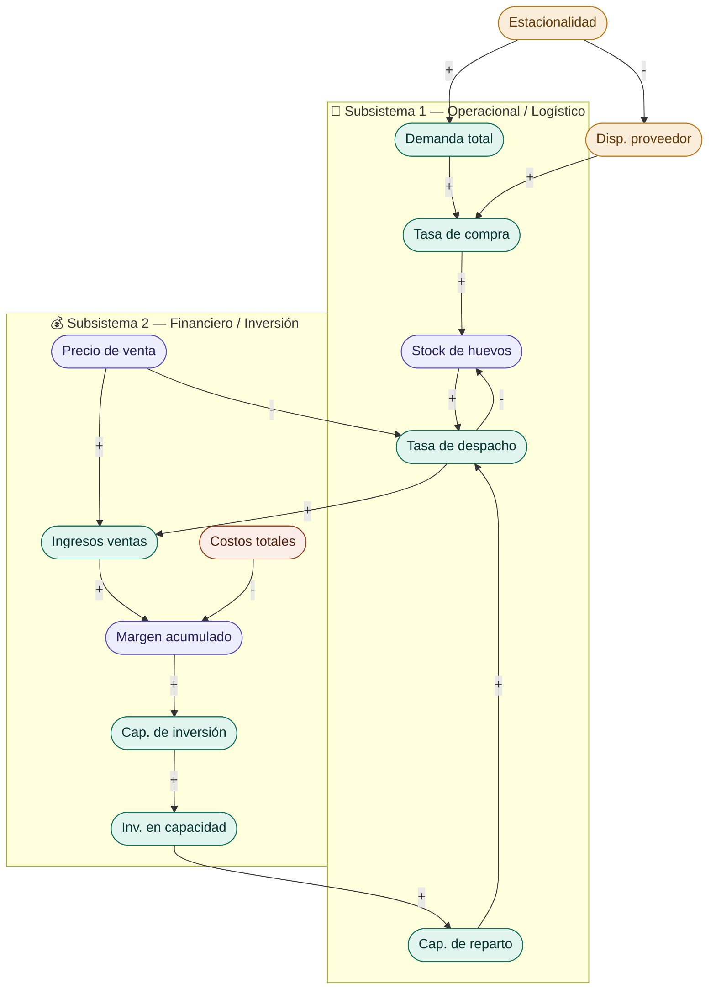

# 🥚 Propuesta de Proyecto — Dinámica de Sistemas en una Distribuidora de Huevos

[← Volver al README principal](../../../README.md)

## El problema

Una distribuidora de huevos de pequeña escala abastece actualmente a:

- supermercados de la zona
- Restoranes locales
- Almacenes de población
- Un nuevo punto de venta (reciente)

**El problema central:** en temporada de verano, la demanda aumenta
significativamente, pero la **capacidad de reparto** no escala al mismo ritmo.
Esto genera un cuello de botella que impide captar nuevos clientes y, en algunos
casos, compromete el servicio a los actuales.

A esto se suma que en los últimos dos veranos consecutivos se han registrado
problemas de disponibilidad por parte del proveedor, precisamente cuando más se
necesita el producto.

La pregunta que guía el modelo es:

> **¿Cuándo conviene invertir en más capacidad (vehículo, personal) y cómo
> afecta esa decisión la rentabilidad del negocio en el tiempo?**

### Variable principal

La **capacidad de reparto** es la variable central del modelo. Es el techo real
del sistema: aunque haya stock disponible y demanda alta, si la capacidad de
reparto está saturada, el negocio no puede despachar más. Toda la pregunta guía
orbita alrededor de esta variable:

- **B1** se activa porque la capacidad de reparto limita la tasa de despacho
- **R1** existe para ampliarla mediante inversión
- **B2** aparece como intento de compensar su limitación vía precio

---

## Subsistemas identificados

### 🚛 Subsistema 1 — Operacional / Logístico

| Variable | Tipo | Descripción |
|----------|------|-------------|
| Stock de huevos disponible | Stock | Nivel de inventario en bodega |
| Tasa de compra al proveedor | Flujo | Cajas adquiridas por período |
| Tasa de despacho | Flujo | Volumen entregado por período |
| Demanda total | Auxiliar | Suma de todos los canales de venta |
| Capacidad de reparto | Auxiliar | **Variable principal** — vehículo propio + apoyo externo |
| Estacionalidad | Exógena | Modula demanda según época del año |
| Disponibilidad del proveedor | Exógena | Fracción de la demanda de compra que el proveedor puede satisfacer |

**Bucle B1 — cuello de botella (balanceo):**
`Stock → Tasa de despacho → Stock`
Cada despacho consume inventario, limitando el despacho siguiente. En verano la
demanda sube pero la capacidad de reparto actúa como techo fijo, saturando el
sistema independientemente del nivel de stock.

---

### 💰 Subsistema 2 — Financiero / Inversión

| Variable | Tipo | Descripción |
|----------|------|-------------|
| Ingresos por ventas | Flujo | Volumen despachado × precio de venta |
| Costo de compra | Flujo | Gasto de adquisición al proveedor por período |
| Costos operacionales | Flujo | Combustible, remuneraciones, arriendo |
| Inversión en capacidad | Flujo | Desembolso puntual en vehículo o personal |
| Margen acumulado | Stock | Diferencia acumulada entre ingresos y costos |
| Capacidad de inversión | Auxiliar | Umbral de margen que habilita la inversión |
| Precio de venta | Parámetro | Fijo en escenario base; con ajuste estacional en escenario de mejora |

**Bucle R1 — crecimiento por inversión (refuerzo):**
`Margen acumulado → Inversión en capacidad → Capacidad de reparto → Tasa de despacho → Ingresos por ventas → Margen acumulado`

**Bucle B2 — tensión precio-volumen (balanceo):**
`Precio de venta ↑ → Tasa de despacho ↓ → Ingresos totales ↓`

> Total: **14 variables** — cumple holgadamente el mínimo de 10 exigido.

---

## Diagrama causal completo

**Conexión entre subsistemas:** la **tasa de despacho** es el vínculo estructural:
drena el stock de huevos (S1) y alimenta los ingresos por ventas (S2).

---

## Bucles de retroalimentación

| Bucle | Tipo | Descripción |
|-------|------|-------------|
| **B1** | Balanceo | Cuello de botella operacional: la capacidad de reparto limita la tasa de despacho, que a su vez contiene el crecimiento del sistema |
| **R1** | Refuerzo | Crecimiento por inversión: mayor margen → inversión → mayor capacidad → más despacho → más ingresos |
| **B2** | Balanceo | Tensión precio-volumen: precio excesivo reduce volumen despachado y contiene los ingresos |

---

## Datos históricos y supuestos

Los datos provienen de los registros reales de operación del negocio durante el
año 2025. Del análisis se desprenden tres observaciones clave para la calibración:

1. **Estacionalidad confirmada.** Enero y febrero concentran los mayores volúmenes
   en compras y ventas, superando en más del doble el promedio mensual del resto
   del año. Esto valida el uso de un índice de estacionalidad como variable exógena.

2. **Brecha entre compras y ventas.** La diferencia mensual entre ventas y compras
   (sin IVA) refleja la sensibilidad del negocio al precio del proveedor y al
   volumen despachado. Esta brecha alimenta el stock de margen acumulado en el modelo.

3. **Respuesta reactiva en temporada alta.** El salto entre noviembre–diciembre y
   enero–febrero evidencia que el negocio compra más solo cuando la demanda ya
   presiona el inventario, sin anticipación.

### Supuestos del modelo

| Supuesto | Valor | Justificación |
|----------|-------|---------------|
| Disponibilidad del proveedor en verano | −20 % | Experiencia de dos períodos estivales consecutivos |
| Capacidad de reparto actual | 200 cajas/semana | Consistente con volúmenes históricos fuera de temporada alta |
| Umbral de inversión | Equivalente al costo de la inversión | Se precisará en la etapa de construcción del modelo |
| Precio de venta en escenario base | Fijo | Permite aislar el efecto de la capacidad operacional |

> 📊 **[Ver datos históricos de compras, ventas y ganancia líquida →](./DATOS_HISTORICOS.md)**

---

## Escenarios de simulación

| Escenario | Descripción |
|-----------|-------------|
| **Base** | Operación actual: sin inversión nueva, camión familiar como contingencia en verano, precio fijo |
| **Mejora** | Compra de vehículo propio + contratación de personal en temporada alta + ajuste de precio en verano |

La comparación permite responder: *¿en cuántos períodos se recupera la inversión
y a partir de cuándo es más rentable que la situación actual?*

---

## Estructura del informe

| Sección requerida | ¿Cubierta? |
|------------------|-----------|
| Portada | ✅ |
| Resumen | ✅ |
| Introducción | ✅ |
| Definiciones y marco teórico | ✅ |
| Definición del problema | ✅ |
| Identificación de subsistemas | ✅ — 2 subsistemas definidos |
| Identificación de variables | ✅ — 14 variables identificadas |
| Influencias de 1°, 2° y 3° orden | ✅ |
| Diagrama causal | ✅ |
| Bucles de retroalimentación | ✅ — 3 bucles identificados |
| Datos históricos y supuestos | ✅ — datos reales 2025 + supuestos justificados |
| Diagrama de Forrester | ✅ |
| Construcción del modelo | ✅ |
| Simulación escenario base | ✅ |
| Propuesta de intervención | ✅ — inversión en vehículo y personal |
| Simulación escenario de mejora | ✅ |
| Resultados | ✅ |
| Conclusiones | ✅ |
| Referencias APA 7 | ✅ |

---

## Herramienta de simulación sugerida

**Python** (`numpy` + `matplotlib`) o **Vensim**. Python tiene la ventaja de que
el modelo queda como script reutilizable para el negocio real.

---

> _Propuesta elaborada para discusión grupal previa a la entrega del 29 de mayo._